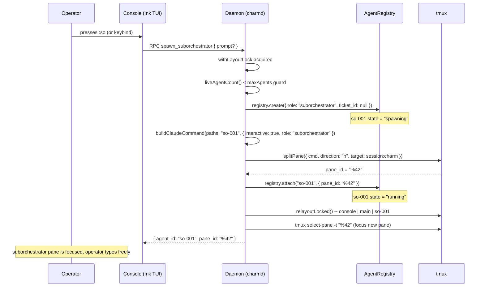
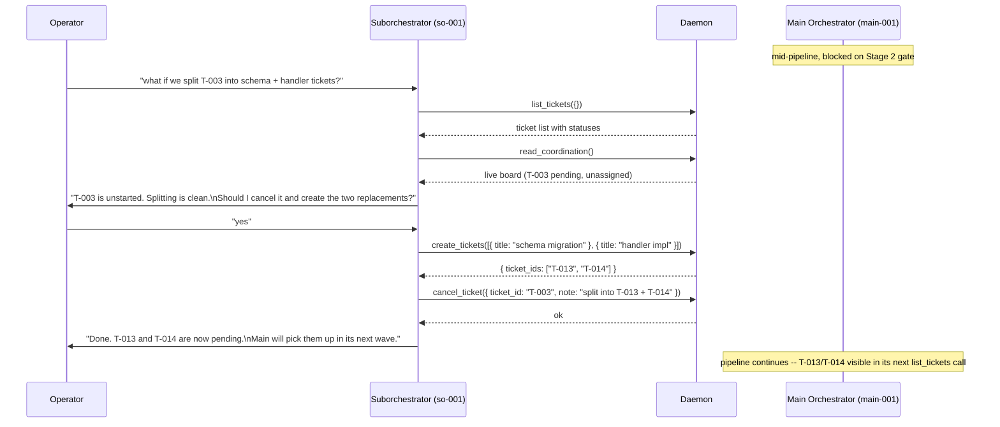
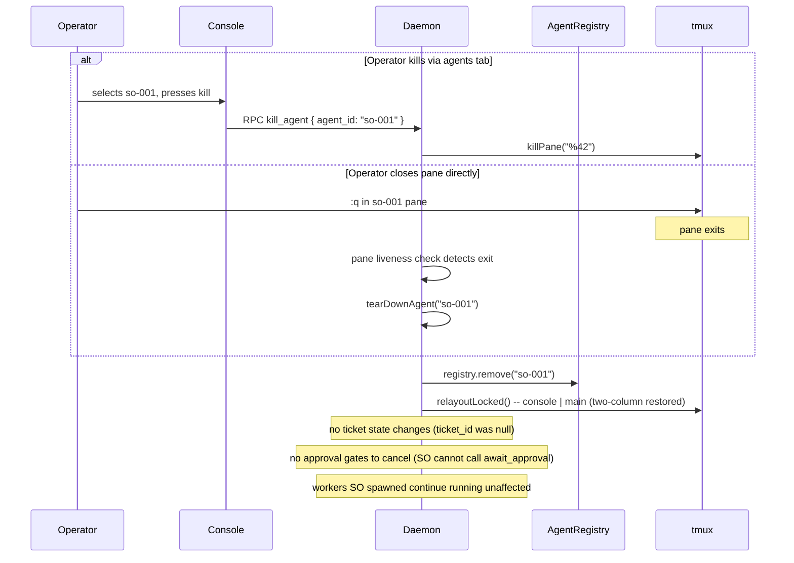

# PROP-operator-spawned-suborchestrator

**Status:** superseded-by: PROP-zed-fork-build-plan/orchestration-model.md

> **Superseded (2026-06-26).** This proposal's live content (the agent role and
> the tool-capability contract) has been absorbed into
> [PROP-zed-fork-build-plan/orchestration-model.md](PROP-zed-fork-build-plan/orchestration-model.md),
> which **redefines** `suborchestrator` as a per-worktree pipeline manager rather
> than the operator-facing brainstorm lieutenant described below. The standalone
> operator-lieutenant (`so-NNN`) is **dropped for v1** there. Kept here only as a
> historical record; build from the orchestration-model doc instead.

---

## Problem

During a charm session the operator has one interactive window: the main
orchestrator. The orchestrator owns the five-stage pipeline, runs discovery
and planning directly, and reaps every sub-agent it spawns. It is busy and
stateful. Typing mid-pipeline questions or design tangents into its window
risks interrupting its gate flow, pushing irrelevant context into a long
session, or derailing its planning.

There is no way to:
- Brainstorm with a fresh-context agent that can see the fleet state
- Explore "what if we also add X?" without committing to tickets
- Delegate a parallel workstream without touching the main pipeline gates
- Get a second opinion on a ticket design without polluting the orchestrator's
  context window

The operator is left choosing between polluting the orchestrator or opening a
completely unconnected Claude window with no fleet visibility.

---

## Context / Findings

Several pieces already exist and constrain or accelerate the design:

- `AgentRole` in `schema.ts` already includes `"suborchestrator"`.
- `DEFAULT_MODEL_BY_ROLE` sets `suborchestrator: "opus-4.8"` and
  `DEFAULT_THINKING_BY_ROLE` sets `suborchestrator: "max"` -- the same budget
  as main, because a suborchestrator needs the same reasoning depth.
- `buildClaudeCommand` in `spawn.ts` already injects the operator skills index
  for `suborchestrator` (same branch as `main`). The role-based prompt lookup
  falls through to `<role>.md`, which resolves to the already-written
  `templates/prompts/suborchestrator.md`.
- The suborchestrator prompt at `templates/prompts/suborchestrator.md` defines
  the agent's posture, tool access, and gate-ownership boundary.
- The tmux layout engine (`relayoutLocked` + `buildLayoutString`) already
  handles N agent panes -- adding a suborchestrator pane to `agentPaneIds`
  requires no layout code changes.
- `spawnAgentLocked` in `daemon/index.ts` is the single chokepoint for all pane
  spawns; a new `spawn_suborchestrator` RPC handler calls it with
  `interactive: true`.

What is missing: the daemon RPC handler, the console hotkey, and the CLI
entry point.

---

## Proposal

### Concept

A suborchestrator is an interactive, operator-facing Claude session opened on
demand, wired to the same charm MCP context as the main agent, running in its
own tmux pane. The operator talks to it directly. The main orchestrator's
pipeline is unaffected. It is a lieutenant the operator can think alongside,
not a second pipeline.

### Agent identity and lifetime

**ID scheme:** `so-NNN`, auto-incremented from the agent registry (e.g.
`so-001`, `so-002`). Separate namespace from workers (`worker-NNN`) and
investigators (`investigator-NNN`).

**Lifetime:**
- Lives until the operator explicitly closes it (kills it from the agents tab
  or closes its tmux pane with `:q`).
- NOT killed when main completes a stage or when the pipeline ends.
- Killed along with all other agents on `charm stop` (normal session teardown).
- Multiple suborchestrators may coexist, subject to the `--max-agents` cap.
- Registry `ticket_id` is always `null` -- SO is not assigned to a ticket.

---

### Spawn flow



### Brainstorm session flow



### Kill and cleanup flow



---

### Tool capability contract

The following table is the authoritative reference. Enforcement is split
between the MCP shim (injects `caller_id` from `CHARM_AGENT_ID`) and the
daemon's `resolveCaller` / `assertOrchestrator` guards.

| Tool | main | suborchestrator | worker / investigator / tester |
|---|---|---|---|
| `list_tickets` | yes | yes | yes |
| `read_coordination` | yes | yes | yes |
| `list_agents` | yes | yes | yes |
| `list_worktrees` | yes | yes | yes |
| `open_graph` | yes | yes | yes |
| `create_tickets` | yes | yes | no |
| `promote` | yes | yes | no |
| `spawn_workers` | yes | yes | no |
| `spawn_investigators` | yes | yes | no |
| `request_review` | yes | yes | no |
| `set_ticket_state` | yes | yes | no |
| `cancel_ticket` | yes | yes | no |
| `kill_agent` (non-main) | yes | yes | self only |
| `continue_agent` | yes | yes | no |
| `update_plan` | yes | yes (own) | yes (own) |
| `set_session_description` | yes | **no** | no |
| `await_approval` | yes | **no** | no |
| `create_worktree` | yes | **no** | no |
| `close_worktree` | yes | **no** | no |
| `report_status` | n/a | n/a | yes (own) |
| `set_ticket_status` | n/a | n/a | yes (own) |

**The `await_approval` prohibition is the central constraint.** Approval gates
are pipeline events -- they push a blocking prompt onto the console's approvals
tab. A suborchestrator is not running a pipeline and must never push a gate.
Gate ownership stays exclusively with main.

**`set_session_description` is main-only.** The session description is visible
in `charm list` and is the operator's primary signal for what this session is
doing. Only main can set it.

**Worktree tools are main-only.** Worktrees are orchestrator-managed side
resources tied to the main pipeline's branch topology. SO has no business
issuing `git worktree add`.

**Workers SO spawns are fleet-level, not SO-owned.** The daemon does not record
which agent spawned a worker. If SO is killed, its workers continue running --
they belong to the fleet, not to the suborchestrator. This avoids orphan-reaping
complexity and is consistent with how main-spawned workers behave.

---

### Daemon changes: `spawn_suborchestrator` RPC

New case in the daemon's RPC switch, alongside `spawn_workers` and
`spawn_investigators`.

**Input schema (add to `schema.ts`):**

```ts
export const SpawnSuborchestratorInput = z.object({
  // absent => human operator (console / CLI).
  // present => main agent (reserved for future orchestrator-spawned SO).
  caller_id: z.string().optional(),
  // Optional opening message. Blank = SO waits for operator input.
  prompt: z.string().optional(),
});
export type SpawnSuborchestratorInput = z.infer<typeof SpawnSuborchestratorInput>;
```

**Authorization:** operator or main only. A worker or tester calling this gets
an `assertOrchestrator` rejection (same guard as `create_tickets`).

**Handler pseudocode:**

```ts
case "spawn_suborchestrator": {
  const input = SpawnSuborchestratorInput.parse(params);
  if (input.caller_id) assertOrchestrator(input.caller_id, "spawn_suborchestrator");
  const agent_id = await withLayoutLock(async () => {
    const id = await spawnAgentLocked({
      role: "suborchestrator",
      ticket_id: null,
      prompt: input.prompt ?? "",
      interactive: true,
    });
    await relayoutLocked();
    await tmux.selectPane(registry.get(id)!.pane_id!);
    return id;
  });
  return { agent_id };
}
```

The only material difference from a worker spawn is `interactive: true` in
the SpawnSpec. Every other path -- registry creation, pane split, layout
refresh -- is identical to existing agent spawning.

---

### Console changes: hotkey

Add a keybinding in `src/console/app.tsx` that sends `spawn_suborchestrator`
to the daemon and moves tmux focus to the new pane.

The agents tab needs no structural changes. `role: "suborchestrator"` and
`ticket_id: null` are already renderable with the existing agent row component.
Suggested display format:

```
so-001   suborchestrator   running   (no ticket)
```

---

### CLI entry point

A `charm suborchestrator [prompt]` subcommand sends the same RPC to a running
daemon. Useful when the operator is outside the Ink TUI.

```
charm suborchestrator "brainstorm the auth refactor options"
```

---

### Prompt composition: what SO loads at spawn

`buildClaudeCommand` for `suborchestrator` already follows the non-main path:
it reads `templates/prompts/suborchestrator.md` and stops. It does NOT
concatenate `discovery.md` or `planner.md`. The operator skills index IS
injected (same `main || suborchestrator` branch in spawn.ts). No changes
needed to `buildClaudeCommand`.

The existing `suborchestrator.md` prompt covers:
- Purpose: operator-facing brainstorm and delegation
- Available tools: the full read + authoring set
- Hard prohibition on `await_approval` and pipeline interference
- Coordination etiquette: read `COORDINATION.md` before touching tickets

---

## Alternatives Considered

**Open a plain Claude window (`charm start` with no goal):** The existing
`--plain` flag opens an MCP-connected window with no role prompt. This works
but carries no `await_approval` prohibition -- the operator could accidentally
push a stage gate -- and it lacks the fleet context framing the suborchestrator
prompt provides. The role is the same mechanism with explicit guardrails baked
in.

**Type directly to the orchestrator:** Works, but pollutes a stateful context
window. During a long session, off-topic brainstorm turns are exactly the kind
of content Claude Code's auto-compression will drop unpredictably. The
orchestrator's planning rationale is too valuable to risk on session noise.

**Separate charm session:** A second `charm start` in a new window gives a
fresh agent, but the two daemons use separate sockets. The brainstorm agent
cannot write tickets into the first session's backlog. Cross-session ticket
authoring is not architecturally supported and would require a non-trivial
daemon-to-daemon bridge.

**Orchestrator-spawned suborchestration (autonomous delegation):** A richer
model where main hands a sub-goal to SO and SO runs its own sub-pipeline.
Deferred -- it requires a defined return contract (KB write, specific ticket
terminal state) and the gate question (does SO `await_approval` in its own
scope?). The operator-facing interactive model ships with far less risk and
closes the immediate brainstorm gap.

---

## Open Questions

1. **Hotkey choice.** Should the console trigger be `:so` (two-keystroke
   sequence in the input box) or a single chord like `Ctrl+O`? Single chords
   are faster but require care around terminal escape sequences in Ink. What is
   the preferred gesture?

2. **Max concurrent SOs.** Should the system cap the number of active
   suborchestrators? There is no hard architectural reason to limit to one, but
   the tmux layout gets crowded past two total agent panes. The `--max-agents`
   ceiling provides an implicit cap. A separate `--max-suborchestrators` flag
   would be explicit but adds config surface.

3. **SO in COORDINATION.md.** `refreshCoordination` currently excludes agents
   with `ticket_id: null`, so SO does not appear on the live board. This seems
   correct -- it is not executing a ticket. Should there be an "interactive
   agents" section in the board output for visibility, or is the agents tab
   in the console sufficient?

4. **Opening prompt UX.** Should the console prompt for an opening message
   before spawning (a small inline input box), or spawn blank and let the
   operator type in the new pane? Blank is simpler; a prompt argument is more
   useful for the CLI entry point. These can differ between the two entry
   points.

---

## Status

draft
