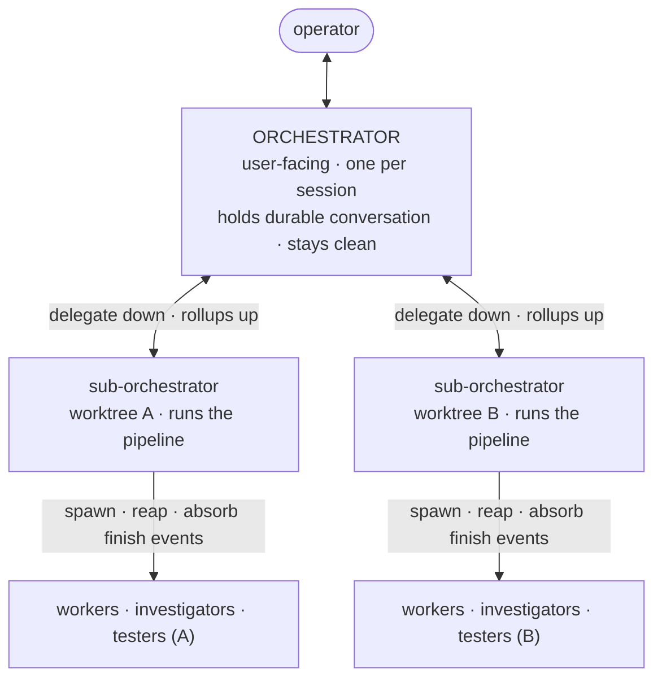

# Orchestration model (architecture foundation)

**Status:** draft -- v1 decisions locked (see Decisions section)

This is the **architecture spine of the Zed-fork build plan.** The phase files
implement it; read this first. It defines the agent hierarchy, the workspace
(`.charm`) layout, and the agent roles + tool-capability contract that every
phase depends on.

A worktree-centric redesign of charm's agent hierarchy and workspace layout: a
single user-facing orchestrator that stays clean, one per-worktree
sub-orchestrator that absorbs the mess, a single shared `.charm` behind a single
daemon, and a lockfile-aware worktree setup step. Captures the design discussed
with the operator on 2026-06-26 and validated against the charm studio design
export (the "Agent orchestrator setup" folder: `HANDOFF.md`,
`Orchestration Canvas.dc.html`, `Charm Studio.dc.html`).

This document **absorbs and supersedes** `PROP-operator-spawned-suborchestrator.md`:
the `suborchestrator` role is redefined here as a per-worktree pipeline manager
(not an operator-facing brainstorm lieutenant), and that proposal's tool-capability
contract is folded into the Agent roles section below.

---

## Problem

Four pain points, all rooted in the current flat single-orchestrator model:

1. **The orchestrator gets clogged.** Every worker, investigator, reviewer, and
   tester pings the one main orchestrator on finish or on events. This is slow
   and burns the orchestrator's context window fast, degrading the exact agent
   the operator most needs to stay sharp.

2. **Injected events collide with the operator's typing.** When the operator is
   composing a message to the orchestrator and a worker event arrives, the
   daemon pastes that event into the orchestrator's live input. The operator's
   half-typed message and the injected text interleave, and the orchestrator
   sees the merged garble before the operator can finish the thought. (Phase 1
   of the Zed-fork plan already flags this as the bracketed-paste hazard.)

3. **`.charm` diverges across worktrees.** `kb/`, `proposals/`, and `tickets/`
   are git-tracked. A git worktree is a full checkout, so each worktree gets its
   own committed copy of those directories from its branch and they drift apart.
   Knowledge and proposals written in one worktree are invisible in another.

4. **Worktree setup is tedious.** A fresh worktree is a bare checkout with no
   `node_modules`, no `target/`, no `.venv`. Re-installing dependencies per
   worktree is slow and wastes disk.

---

## Context / findings (verified against current state)

- **`.charm` git-tracking:** only `worktrees/` is gitignored (`.charm/.gitignore`
  is one line). `kb/`, `proposals/`, and `tickets/` are tracked; `run/`,
  `db.sqlite`, `scratchpad/`, and session bookkeeping are not. This is why
  worktree `.charm` copies diverge, and why naive symlinking of those dirs
  fights git (see Alternatives).
- **Worktrees already exist** at `.charm/worktrees/<name>/` (currently
  `zed-fork` on `charm/zed-fork`). Because `worktrees/` is gitignored, the
  checkout is not double-committed. A worktree's own `.charm/worktrees/` is empty
  (gitignored), so nesting is bounded.
- **One daemon per session today:** each `charm start` is one tmux session, one
  daemon, one UUID. `spawnAgentLocked` is the single chokepoint for all pane
  spawns; the registry and ticket counter are daemon-owned.
- **The schema already has a `suborchestrator` role** with `opus-4.8` / `max`
  thinking defaults, currently defined (in `PROP-operator-spawned-suborchestrator.md`)
  as an operator-facing brainstorm lieutenant. This proposal redefines that role
  (see Naming).
- **The design export already assumes this hierarchy.** charm studio's canvas
  (`HANDOFF.md` section 7.2) draws a center **orchestrator** square, one
  **sub-orchestrator** square *per git worktree* ("the child orchestrator running
  inside a worktree"), and **agents** as circles orbiting their sub-orchestrator.
  But it has no real backend for it: the layout algorithm (section 8) *infers*
  the tree by scanning each ticket's `touches:` for a `worktrees/<name>/`
  segment. The UI is built; the backend that produces a real hierarchy is not.

---

## Proposal

### 1. Agent hierarchy

- **Orchestrator** (top, one per session): the only agent the operator talks to.
  Holds the durable conversation and the high-level plan. Delegates goals to
  per-worktree sub-orchestrators and receives concise rollups. **Does not** spawn
  or reap leaf workers directly and **does not** receive their finish/event
  pings. Its context stays clean.
- **Sub-orchestrator** (one per worktree): runs the five-stage pipeline *inside*
  its worktree. Spawns/reaps its workers, owns its worktree's coordination board,
  and absorbs all the noisy finish/event traffic. Reports rollups up to the
  orchestrator. This is the agent that is "allowed to get messy."
- **Workers / investigators / testers**: unchanged in kind, but scoped to a
  worktree and reporting to that worktree's sub-orchestrator, not to main.
- The main session has **no** sub-orchestrator of its own. The operator talks to
  the orchestrator directly; per-worktree sub-orchestrators are the only "sub"
  layer.

#### Agent roles and tool-capability contract

(Absorbed from `PROP-operator-spawned-suborchestrator.md` and updated for the new
hierarchy. Enforcement is split between the MCP shim, which injects `caller_id`
from `CHARM_AGENT_ID`, and the daemon's `resolveCaller` / `assertOrchestrator`
guards.)

| Tool | orchestrator | sub-orchestrator | worker / investigator / tester |
|---|---|---|---|
| `list_tickets`, `read_coordination`, `list_agents`, `list_worktrees`, `open_graph` | yes | yes | yes |
| `create_tickets`, `promote`, `cancel_ticket`, `set_ticket_state` | yes | yes (its worktree) | no |
| `spawn_workers`, `spawn_investigators`, `request_review` | yes | yes (into its worktree) | no |
| `kill_agent` (non-self) | yes | yes (its own fleet) | self only |
| `continue_agent` | yes | yes (its own fleet) | no |
| `update_plan` | yes | yes (own) | yes (own) |
| `create_worktree`, `close_worktree` | yes | no | no |
| `await_approval` (Stage 2, plan) | no | yes (its worktree) | no |
| `await_approval` (Stage 4, merge-to-main) | yes | no -- escalates up | no |
| `set_session_description` | yes | no | no |
| `report_status`, `set_ticket_status` | n/a | n/a | yes (own) |

Key shifts from the old single-orchestrator model:
- The **orchestrator** sheds pipeline execution. It creates worktrees, delegates
  a goal to each worktree's sub-orchestrator, owns the Stage-4 merge gate, and
  talks to the operator. It does not spawn or reap leaf agents.
- The **sub-orchestrator** is what the old `main` role used to be, but scoped to
  one worktree: it runs the pipeline, spawns/reaps its fleet, and owns the Stage-2
  plan gate *internally* (see Decisions).
- `create_worktree` / `close_worktree` stay orchestrator-only -- worktree
  topology is the orchestrator's job, not a sub-orchestrator's.

### 2. Context insulation + the typing-collision fix

The hierarchy alone removes most of the clog and the collision, because the
user-facing orchestrator no longer receives worker pings. For the residual
orchestrator <-> sub-orchestrator messaging, move from **push** to **pull**:

- The daemon never pastes into the orchestrator's live input while the operator
  is composing. Events queue and are delivered at a turn boundary, or the
  orchestrator pulls a rollup on its own turn.
- The Zed fork makes this materially easier than tmux: a real `TerminalView`
  handle can tell whether the human is mid-input, so injection can be gated on
  "operator idle." (This refines Phase 1's `inject_text` design.)

### 3. One `.charm`, one daemon, MCP-mediated writes

Do **not** fork `.charm` into per-worktree instances and do **not** symlink the
git-tracked durable dirs (that fights git -- see Alternatives). Instead:

- **One daemon per session**, living in the main workspace, owns the single
  `.charm`: one ticket counter, one registry, one KB, one proposals tree. It
  spawns the orchestrator and every sub-orchestrator across all worktrees and
  routes events between them.
- Worktree agents write durable artifacts (tickets, KB, proposals) **through MCP
  tools**, which talk to that daemon -- so the physical path is irrelevant and
  nothing diverges. The only thing a worktree genuinely owns is its **code
  checkout**, which git already provides.

What is shared vs. per-worktree:

| Concern | Where it lives |
|---|---|
| Tickets (single counter + dir) | shared -- main `.charm`, via daemon |
| Knowledge base (`kb/`) | shared -- main `.charm`, via daemon |
| Proposals | shared -- main `.charm`, via daemon |
| Daemon socket / `run/` | main `.charm` (agents connect via env, not relative path) |
| Per-worktree coordination board | per worktree (each sub-orchestrator's fleet) |
| Code working tree | per worktree (git) |
| Dependency dirs (`node_modules`, `target/`, ...) | per worktree, symlinked when safe (see 4) |

Tickets stay in the tree and keep their IDs, but the orchestrator/operator can
treat them as a background mechanism rather than a thing to curate by hand.

### 4. Worktree setup / dependency-sharing preflight

On first `charm start` in a repo (or when a worktree is created), run a preflight
that shares heavy, branch-invariant, gitignored dependency dirs across worktrees
by symlink instead of reinstalling:

- Detect candidates: `node_modules`, `.venv`/`venv`, Rust `target/`, build caches
  (`.next`, `dist`, `vendor/`, etc.).
- **Lockfile-aware sharing (the load-bearing rule):** share a dependency dir only
  when the worktree's lockfile hash matches main's
  (`package-lock.json`/`yarn.lock`/`pnpm-lock.yaml`/`Cargo.lock`/`uv.lock`). If a
  branch changes deps, do **not** share -- install locally for that worktree, or
  the shared dir is wrong for it (or gets corrupted on install). Rust `target/`
  is usually shareable but can thrash rebuilds and contends on cargo's lock; make
  it opt-in.
- Ask the operator once which dirs to share (with detected suggestions), persist
  the answer to a shared config in main's `.charm`, and auto-apply to future
  worktrees. This lands naturally in Zed-fork Phase 5 (session bootstrap).

### 5. Naming

- **Orchestrator** = the top, user-facing agent. (The operator floated
  "lieutenant" for this; folded into "orchestrator," which matches the canvas's
  center square and the existing `main` role.)
- **Sub-orchestrator** = the per-worktree pipeline manager. This **redefines** the
  existing `suborchestrator` role (currently the operator brainstorm lieutenant in
  `PROP-operator-spawned-suborchestrator.md`). The schema slot and its opus/max
  defaults fit a per-worktree orchestrator well.
- The operator-facing brainstorm lieutenant (`so-NNN`) from the older proposal is
  **dropped for v1** (see Decisions): the now-clean user-facing orchestrator
  serves that need. The redefined `suborchestrator` role and its opus/max model
  defaults are reused for the per-worktree manager.

### 6. How this threads into the Zed-fork build plan

- **Phase 1 (the bridge):** `CharmState` must gain first-class hierarchy --
  `agent.parent_id`, `agent.worktree`, and a sub-orchestrator record type -- so
  the bridge *carries* the `orchestrator -> sub-orchestrator -> agent` tree
  instead of the canvas re-deriving it from `touches:` strings. Plus the
  push->pull / idle-gated injection refinement.
- **Phase 5 (bootstrap):** the worktree setup preflight and dependency-sharing.

---

## Viability verdict (vs. the design export)

| Pillar | Verdict | Note |
|---|---|---|
| Orchestrator -> per-worktree sub-orchestrators -> workers | VIABLE | Canvas already models it; work is daemon-side routing + redefining the `suborchestrator` role |
| Typing-collision fix | VIABLE | Hierarchy removes most of it; push->pull + idle-gating handles the rest; easier in the fork than tmux |
| Per-worktree `.charm` via symlinks | REWORK | Symlinks fight git-tracked dirs; use one `.charm` + one daemon + MCP-mediated writes instead |
| Worktree dependency-sharing preflight | VIABLE (caveat) | Clean for gitignored dirs; must be lockfile-aware to avoid corrupting shared deps across branches |

The design export is effectively a UI realization of this hierarchy already, so
the front end is not the risk -- the backend that produces a real hierarchy, and
the single-`.charm`/single-daemon assumption, are the load-bearing pieces.

---

## Alternatives considered

- **Symlink each worktree's `.charm/{kb,proposals,tickets}` to main.** Rejected:
  those dirs are git-tracked, so a worktree would see the tracked files become a
  symlink (a delete/type-change), producing a dirty tree and wrong commits. The
  intent ("don't fork `.charm`") is right; the mechanism is wrong. Single `.charm`
  behind the daemon achieves the same end without fighting git.
- **One daemon per worktree.** Rejected: multiple daemons writing one shared
  tickets dir race on the counter and the registry. One session-level daemon
  owning all worktrees matches the design export's single-IPC-backend model
  (`HANDOFF.md` section 11).
- **Untrack `kb`/`proposals`/`tickets` so symlinks are clean.** Rejected: these
  are meant to be durable and versioned; losing their git history defeats the
  purpose of proposals and the KB.

---

## Decisions (v1 -- locked for the build)

These were open questions; they are now locked as the v1 spec the phases build
against. Each is a default chosen for lowest risk and is overridable -- flagged so
the operator can revisit, but the build proceeds on these unless changed.

1. **Gate ownership -- SPLIT.** The sub-orchestrator owns the **Stage-2 plan**
   gate *inside its worktree* (it approves its own workers' plans). The
   **Stage-4 merge-to-main** gate bubbles up to the orchestrator, because the
   orchestrator owns the shared tree and is the only safe place to approve a
   merge. Anything a sub-orchestrator cannot resolve also escalates up.
2. **Return contract -- terminal ticket state + a rollup.** A sub-orchestrator
   signals "worktree done" by driving its tickets to a terminal state and
   emitting a single rollup (summary + the proposed merge) to the orchestrator.
   The orchestrator then runs the Stage-4 merge gate. No new bespoke "done" RPC;
   it rides the existing status/rollup channel.
3. **Operator lieutenant -- DROPPED for v1.** The standalone `so-NNN` brainstorm
   agent is not built. Its need (a clean agent the operator can think alongside)
   is now served by the user-facing orchestrator, which stays clean by design.
   Can be re-added later as a distinct off-graph helper under a different name if
   a real need appears.
4. **Injection -- PULL / idle-gated.** The daemon never pastes into the
   orchestrator's input while the operator is composing. The orchestrator pulls
   rollups on its own turn. Sub-orchestrators (the messy layer) may receive
   injected events but still idle-gated.
5. **Ticket-counter concurrency -- daemon-serialized.** All ticket authoring goes
   through the single daemon, which owns the counter; no agent writes ticket files
   directly. (Build task: confirm no direct-write path bypasses the daemon.)
6. **One daemon, single `.charm`.** One session-level daemon in main owns the one
   `.charm`; worktree agents write durable artifacts via MCP. Per-worktree = code
   checkout + symlinked deps only.

## Still open (do not block the build)

- **Rollup cadence.** Whether the orchestrator pulls rollups on its own turn, on a
  timer, or on a sub-orchestrator milestone. Default to on-its-own-turn; tune
  later.
- **Caps.** Max concurrent worktrees / sub-orchestrators before the canvas and the
  machine crowd. No hard cap in v1; revisit if it bites.

---

## Status

draft -- v1 decisions locked; phase files implement this spec
