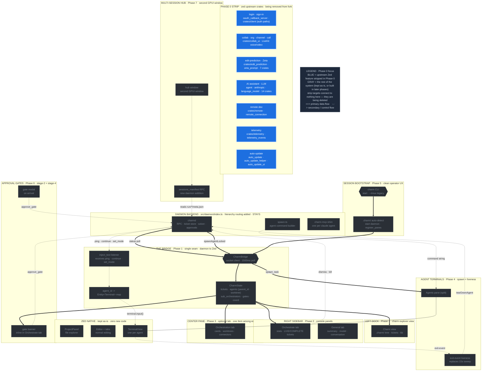

# Phase 0 — Clean Zed fork (strip what we will never use)

**Status:** draft
**Blocks:** Phase 1 (transitively all later phases)
**Source:** T-026 (fork setup), Gram fork prior art, operator walkthrough of the running app

This is the first thing we do. Strip the features charm will never use. There
are no Cargo feature flags for any of these, so the only path is removing crates
from the workspace, deleting their UI call sites, and cleaning the related
settings.

---

## Where this phase sits in the architecture

The full charm-on-Zed architecture, with the components **Phase 0 strips** highlighted in blue. Everything gray is kept (or built in a later phase). Same diagram as the [architecture overview](architecture-diagram.svg), recolored to this phase.



---

## Operator removal list (UI-driven — the authoritative target list)

Derived from walking through the running Zed app. Each item maps to the crates,
UI surfaces, and settings that implement it.

| # | Remove / Keep | Feature (as seen in the app) | What it maps to in the source |
|---|---|---|---|
| 1 | **REMOVE** | Sign-in button / login | Title-bar sign-in UI (`crates/title_bar/src/title_bar.rs`, settings `show_sign_in` + `show_user_menu` in `title_bar_settings.rs`); Zed Cloud auth in `crates/client`; `crates/oauth_callback_server` |
| 2 | **REMOVE** | Organization stuff | Org/channel concepts surfaced via `crates/collab_ui` (`collab_panel.rs`) and any org pages in `crates/settings_ui`; mostly falls out once collab is removed (see #4) |
| 3 | **KEEP** | Panel layouts | Zed's dock/panel layout system (`crates/workspace`) — untouched; charm relies on it |
| 4 | **REMOVE** | Collaborative working ("work with your team in real time — collaborative editing, voice, shared notes") | `crates/collab_ui`, `crates/call` (LiveKit voice/video), `crates/channel`, server-side `crates/collab` |
| 5 | **REMOVE** | Edit prediction (Zed's inline AI completion / Zeta) | `crates/edit_prediction`, `edit_prediction_cli`, `edit_prediction_context`, `edit_prediction_metrics`, `edit_prediction_types`, `edit_prediction_ui`, `crates/zeta_prompt`; the status-bar edit-prediction button; the `edit_prediction_*` settings block; the `settings_ui/src/pages/edit_prediction_provider_setup.rs` page |
| 6 | **KEEP** | Terminal + debugging | `crates/terminal`, `terminal_view`; debugger `crates/dap`, `dap_adapters`, `debug_adapter_extension`, `debugger_tools`, `debugger_ui` — all kept. Any AI hook in the debugger gets repointed to Claude later (out of scope for Phase 0; noted so it is not stripped). |

The "KEEP" rows matter as much as the "REMOVE" rows — they are explicit guards
against over-stripping (a worker following the AI-removal group must not delete
the debugger or terminal).

---

## Crates to delete (by group)

The operator list above plus the standard Gram-style strip. Edit-prediction and
the account/auth crates are additions beyond the original AI/collab/remote set.

| Group | Crates |
|---|---|
| Login / account / auth (#1) | `oauth_callback_server`; gut `client` (see gotcha) |
| Collaboration (#2, #4) | `collab_ui`, `call`, `channel` (server-side `collab` optional) |
| Edit prediction / Zeta (#5) | `edit_prediction`, `edit_prediction_cli`, `edit_prediction_context`, `edit_prediction_metrics`, `edit_prediction_types`, `edit_prediction_ui`, `zeta_prompt` |
| AI / LLM assistant | `agent`, `agent_servers`, `agent_settings`, `agent_skills`, `agent_ui`, `anthropic`, `bedrock`, `language_model`, `language_model_core`, `language_models`, `language_models_cloud`, `copilot`, `copilot_chat`, `copilot_ui` |
| Remote development | `remote`, `remote_connection` |
| Telemetry | `telemetry`, `telemetry_events` |
| Auto-update | `auto_update`, `auto_update_helper`, `auto_update_ui` |

> Note: `agent_settings` is also referenced by the editor/inline-assist paths —
> audit before deleting, like `client`. When in doubt, gut (remove the feature
> wiring) rather than delete the crate outright.

---

## Settings cleanup

Stripping a feature leaves dangling settings keys and settings-UI pages. After
the crate removals, clean these so the Settings page does not reference removed
features:

- **`crates/settings_ui`** — remove the pages tied to removed features:
  `pages/edit_prediction_provider_setup.rs`, any account/sign-in page, any
  collaboration/calls page. Audit `page_data.rs` and `settings_ui.rs` for
  entries pointing at removed crates.
- **`title_bar_settings.rs`** — drop `show_sign_in` and `show_user_menu` (or
  hardcode them off) so the title bar never renders the account UI.
- **Edit-prediction settings block** — remove the `edit_prediction_*` keys from
  the default settings schema (`assets/settings/`) and the settings content
  structs (`crates/settings_content`).
- **Assistant / agent settings** — remove the `agent`/`assistant` settings group
  once the AI crates are gone.
- **Calls / collaboration settings** — remove once `call`/`collab_ui` are gone.

The goal: open the Settings page in the stripped build and see only settings
for features that still exist (editor, terminal, debugger, theme, panel
layouts, keymap).

---

## Files to touch (mechanism)

1. **Root `Cargo.toml`** — remove the crates from `[workspace.members]` and
   `[workspace.dependencies]`.
2. **`crates/zed/Cargo.toml`** — remove the crates as direct deps.
3. **`crates/zed/src/main.rs`** — delete `use` imports and `::init(cx)` call
   sites for each stripped crate.
4. **`crates/title_bar/src/title_bar.rs`** — delete the sign-in button, user
   menu, and any organization/collab UI in the title bar.
5. **`crates/settings_ui/`** — delete the settings pages for removed features.

---

## The cascade dependency problem (the trap)

This is what broke the first strip attempt. You cannot delete a crate from
`[workspace.dependencies]` while other crates still reference it via
`dependency.workspace = true` in their own `Cargo.toml`. ~47 other crates
transitively reference the AI/collab crates.

The error looks like:

```
error: failed to load manifest for workspace member `.../crates/acp_thread`
Caused by: error inheriting `language_model` from workspace root manifest's
           `workspace.dependencies.language_model`
Caused by: `dependency.language_model` was not found in `workspace.dependencies`
```

**The correct order of operations** is a proper dependency-graph teardown, not
"delete the targets and fix the fallout":

1. Build the reverse-dependency graph: for each target crate, find every crate
   that lists it (`grep -rl "<crate>.workspace = true" crates/*/Cargo.toml`).
2. Classify each dependent: is it *also* something we want to delete (e.g.
   `acp_thread` is part of the AI surface), or a crate we keep that needs the
   dependency line removed and its call-sites patched?
3. Delete leaf-first: remove crates nothing-we-keep depends on, then work inward.
4. For each kept crate that referenced a deleted one, remove the dep line AND
   delete the code that used it. This is the real work — not just manifest edits.

This is a multi-day effort. Budget for it.

---

## Do NOT delete

- **`crates/text`** — the CRDT buffer model. The CRDTs are how every buffer
  works; orthogonal to the collaborative-editing *network* feature
  (`collab_ui`/`call`/`channel`). Removing `text` breaks everything.
- **`crates/client`** — entangled with BOTH the Zed Cloud collab connection AND
  the LLM token refresh. After stripping AI and collab, audit whether it can be
  removed entirely or just gutted. Safe to gut, dangerous to blindly drop.
- **`crates/collab`** — the server-side daemon binary; harmless to keep, won't
  link into the main binary either way.
- **Debugger + terminal** — `dap`, `dap_adapters`, `debug_adapter_extension`,
  `debugger_tools`, `debugger_ui`, `terminal`, `terminal_view`. Explicitly kept
  (operator list #6).

---

## Toolchain notes

- Rust `1.95.0` is pinned in `rust-toolchain.toml`.
- **Build prerequisites the preview build hit:** `cmake` (`brew install cmake`)
  and the **Metal Toolchain** (`xcodebuild -downloadComponent MetalToolchain`,
  ~700MB) are both required on macOS — the build fails without them. Document
  these in the fork README.
- If charm will not support user-installable extensions, the `wasm32-wasip2`
  and `wasm32-unknown-unknown` targets can be removed from
  `rust-toolchain.toml`. The `x86_64-unknown-linux-musl` target is only for the
  `remote_server` binary — remove once remote dev is stripped.

---

## Build + verify

```
cargo run               # debug build, fastest iteration
```

First cold build on Apple Silicon: ~3 min (after cmake + Metal toolchain are
present). `cargo run` in dev mode needs no code signing.

**Done when:** `cargo run` launches a working editor with **no sign-in button,
no collaboration/organization UI, no edit-prediction**, the Settings page shows
only surviving features, and the terminal + debugger still work. The
LiveKit/WebRTC native libs from `call` are the biggest binary-size win.

---

## Status: draft
