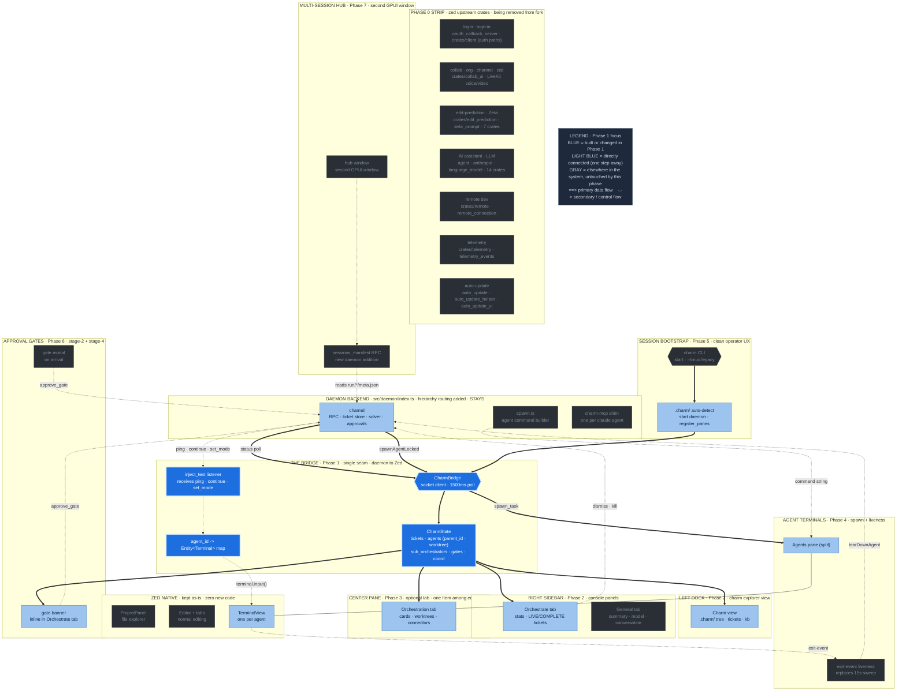

# Phase 1 — Charm daemon bridge

**Status:** draft
**Depends on:** Phase 0 (clean build)
**Blocks:** Phases 2, 3, 4, 5, 6, 7
**Source:** T-024 (IPC surface), T-027 (GPUI async-to-UI pattern)

Add a Unix socket client inside the Zed fork that connects to the charm daemon
and drives all state changes into GPUI entities. This is the single integration
point between the unchanged daemon backend and the new native UI.

---

## Where this phase sits in the architecture

The full charm-on-Zed architecture, with **Phase 1** highlighted in blue and its direct dependencies (one step away) in light blue. Everything gray is elsewhere in the system, untouched by this phase. Same diagram as the [architecture overview](architecture-diagram.svg), recolored to this phase.



---

## First: scaffold the `crates/charm/` crate

All new fork code (this bridge, the sidebar, the orchestration item, the
explorer view) lives in a new workspace crate that does not exist in stock Zed.
Before any of the below: create `crates/charm/`, add it to the root
`Cargo.toml` `[workspace.members]`, give it a `Cargo.toml` depending on `gpui`,
`workspace`, `terminal`, `terminal_view`, `project`, `markdown`, `ui`, and wire
`charm::init(cx)` into `crates/zed/src/main.rs`. Per the repo's Rust guidelines,
set `[lib] path = "src/charm.rs"` rather than relying on `lib.rs`. This is the
first task of Phase 1 (Phase 0 only deletes crates; it does not create this one).

---

## The state entity

Everything the UI renders reads from one shared entity, updated by the bridge.

**New file: `crates/charm/src/charm_bridge.rs`**

```rust
pub struct CharmBridge {
    socket_path: PathBuf,
    state: Entity<CharmState>,
}

/// One record per worktree sub-orchestrator.
/// The daemon status RPC returns this list alongside the flat agent list.
/// Phase 3 (canvas) derives WorktreeGroup from this -- NOT from touches: scanning.
pub struct SubOrchestratorRecord {
    pub id: AgentId,
    pub worktree: String,
    pub status: AgentStatus,
    pub agent_count: usize,
}

pub struct AgentRecord {
    pub id: AgentId,
    pub parent_id: Option<AgentId>,  // None for the top-level orchestrator
    pub worktree: Option<String>,    // None for main-session (non-worktree) agents
    // ticket_id, role, status, and other existing fields remain
}

pub struct CharmState {
    pub tickets: Vec<Ticket>,
    pub agents: Vec<AgentRecord>,
    pub sub_orchestrators: Vec<SubOrchestratorRecord>,
    pub pending_gates: Vec<PendingGate>,
    pub coordination: String,
    pub session: SessionMeta,
}
```

The panels, canvas, and terminal-tab logic all hold a handle to `Entity<CharmState>`
and re-render when it notifies.

`CharmState` now carries first-class hierarchy data. The agent hierarchy is
orchestrator -> per-worktree sub-orchestrators -> leaf workers/investigators/testers.
`agent.parent_id` encodes each agent's direct parent in that tree; `agent.worktree`
names the worktree it belongs to (matching the `SubOrchestratorRecord.worktree` key).
`sub_orchestrators` is the authoritative list of worktree managers for this session.
Phase 3 (the orchestration canvas) derives its `WorktreeGroup` list directly from
`CharmState.sub_orchestrators` keyed on `agent.worktree` -- the old approach of
inferring worktree membership by scanning `touches:` path segments is explicitly
replaced by these first-class fields.

---

## The polling loop (data in)

Mirror the Ink console's `useStatus` hook: poll the daemon `status` RPC every
1500ms on a background task, apply the result, and notify.

```rust
fn start_polling(&self, cx: &mut Context<Self>) {
    let socket = self.socket_path.clone();
    let state = self.state.clone();
    cx.spawn(async move |_, cx| {
        loop {
            cx.background_executor().timer(Duration::from_millis(1500)).await;
            if let Ok(snapshot) = rpc_call(&socket, "status", json!({})).await {
                state.update(cx, |s, cx| {
                    s.apply(snapshot);
                    cx.notify();
                }).ok();
            }
        }
    }).detach();
}
```

This is the canonical GPUI pattern for "data arrived from an external async
source, re-render": a background task that calls `entity.update(cx, |s, cx| {
...; cx.notify(); })`.

### `apply()` contract: agent-list diff and spawn callbacks

`CharmState.apply(snapshot)` does more than overwrite fields. It diffs the
incoming agent list against the previous snapshot and fires an `on_agent_spawned`
callback for each agent ID that is new since the last poll. Phase 4 registers
this callback to open a terminal pane for the new agent. This is Option A from
the cross-phase consistency audit -- the diff runs inside the existing status
poll, so no new daemon push channel is needed and the diagram's `spawnAgentLocked`
arrow is understood as "the status poll detects the spawn." Phase 4's terminal
manager is the only consumer of the callback; it registers its handler once at
bridge construction time.

```rust
// Simplified apply() diff contract:
fn apply(&mut self, snapshot: CharmStateSnapshot) {
    let prev_ids: HashSet<AgentId> = self.agents.iter().map(|a| a.id).collect();
    self.agents = snapshot.agents;
    self.sub_orchestrators = snapshot.sub_orchestrators;
    // ... update tickets, pending_gates, coordination, session
    for agent in &self.agents {
        if !prev_ids.contains(&agent.id) {
            if let Some(cb) = &self.on_agent_spawned {
                cb(agent.id, agent.worktree.clone());
            }
        }
    }
}
```

**Daemon `status` RPC extension:** the daemon's `status` RPC response must be
extended to carry the hierarchy. The existing flat `agents` list must now include
`parent_id` and `worktree` per agent record, and the response must include a
top-level `sub_orchestrators` array (one entry per active worktree sub-orchestrator,
shape matching `SubOrchestratorRecord` above). The bridge cannot populate the
revised `CharmState` without this data. The daemon-side field names are
`parentId` / `worktree` in JSON and map to the Rust struct fields above during
deserialization.

**Future improvement (not Phase 1):** replace 1500ms polling with a daemon-push
channel so the canvas updates instantly. The daemon already writes
COORDINATION.md on every state change -- a push extension to the socket protocol
or a file-watch bridge would eliminate the up-to-1.5s lag. Polling is fine to
ship first.

---

## Text injection (data out — the hard part)

`pingOrchestrator` and `continue_agent` work today by injecting text into a
running claude PTY via tmux `paste-buffer`. In the fork, the daemon must reach
the right `TerminalView` and call `terminal.input(bytes)`.

```rust
// On receiving an inject_text request for a given agent:
terminal_entity.update(cx, |terminal, cx| {
    terminal.input(text.into_bytes());
});
```

`Terminal::input` writes directly to the PTY master fd — the same channel tmux's
`paste-buffer -p` ultimately writes to.

**Unvalidated risk (T-028 Risk 1):** the tmux path needed *bracketed paste*
specifically because plain `send-keys -l` broke on multi-line messages. It is
not yet confirmed that a bare `terminal.input(bytes)` with embedded newlines
lands intact in claude's REPL -- if the REPL has bracketed paste enabled, a
multi-line message may submit early on the first newline. Prototype multi-line
injection against a real claude REPL before assuming it works; if it breaks,
wrap the bytes in the bracketed-paste escape sequence (`ESC[200~ ... ESC[201~`)
the way tmux does. A bug here causes silent orchestrator-wake failures.

The bridge keeps a map of `agent_id -> Entity<Terminal>` populated as agents
spawn (see [Phase 4](phase-4-terminal-tabs.md)). When an inject request arrives
for an agent_id, it looks up the terminal entity and calls `input()`.

### Idle-gated injection (orchestration model Decision 4)

The raw `terminal.input()` call above is the right mechanism but must be gated
based on the inject target. The typing-collision hazard from the current tmux
model -- where a worker finish event gets pasted into the orchestrator's input
while the operator is mid-sentence -- is eliminated by pull/idle-gating. The
gating contract by target tier:

- **Orchestrator terminal:** never inject while the operator is composing. The
  `TerminalView` for the orchestrator pane exposes an idle signal that tells
  whether the terminal currently has pending human input. When an inject request
  arrives for the orchestrator's `agent_id`, check that signal before calling
  `terminal.input()`. If the operator is mid-input, queue the payload and deliver
  at the next idle boundary (turn boundary). In practice the orchestrator pulls
  rollups on its own turn, so most inject-to-orchestrator traffic is the daemon
  delivering queued events when the orchestrator's pane becomes idle.

- **Sub-orchestrator terminals:** idle-gated, but the sub-orchestrator is the
  "allowed to get messy" layer. Queuing is acceptable here; short delivery delay
  is fine. Apply the same idle-check pattern as the orchestrator but do not need
  to be as strict about turn boundaries.

- **Worker / investigator / tester terminals:** direct `terminal.input()` with no
  gating. Leaf agents are not composing messages the operator cares about, so
  injection races are not a hazard here.

The bridge resolves the target tier from the `agent_id -> Entity<Terminal>` handle
map by looking up the agent's role in `CharmState.agents` (the `AgentRecord`
carries role/parent_id so the bridge can classify any agent_id without a separate
lookup). The inject listener dispatches through a single entry point that applies
this three-tier routing before calling `terminal.input()`.

```rust
// Idle-gated dispatch (sketch):
fn dispatch_inject(&self, agent_id: AgentId, text: String, cx: &mut Context<Self>) {
    let tier = self.state.read(cx).agent_tier(agent_id);
    let terminal = self.handle_map.get(&agent_id).cloned();
    match tier {
        AgentTier::Orchestrator | AgentTier::SubOrchestrator => {
            // queue; deliver on next idle signal from the TerminalView
            self.inject_queue.push(agent_id, text);
            self.schedule_idle_flush(terminal, cx);
        }
        AgentTier::Leaf => {
            if let Some(t) = terminal {
                t.update(cx, |term, _| term.input(text.into_bytes()));
            }
        }
    }
}
```

---

## Daemon-side change

The daemon currently calls `tmux.sendText(paneId, text)`. It needs to instead
notify the bridge. Options (this is open question #2 in the README — prototype
to pick):

- **(a)** The bridge opens a second listen socket for push events; the daemon
  connects and sends `inject_text` messages.
- **(b)** Extend the existing socket protocol with a server-push frame the
  bridge subscribes to.
- **(c)** The bridge registers terminal handles keyed by agent_id, and the Zed
  action system routes inject requests internally (daemon writes a marker, the
  bridge's poll picks it up — higher latency, simplest to build).

The daemon already tracks `agentPaneIds`; the registration ceremony
(`register_panes` RPC) stays, but the handle type changes from tmux pane id to
the Zed fork's terminal entity id (still a string over the wire).

---

## Socket detection

On Zed fork startup, scan the workspace root for `.charm/run/*/sock`. If found,
construct the `CharmBridge` and start polling. If not, the fork behaves as a
plain editor (no charm UI). This makes the charm integration opt-in per
workspace.

---

## Status: draft
