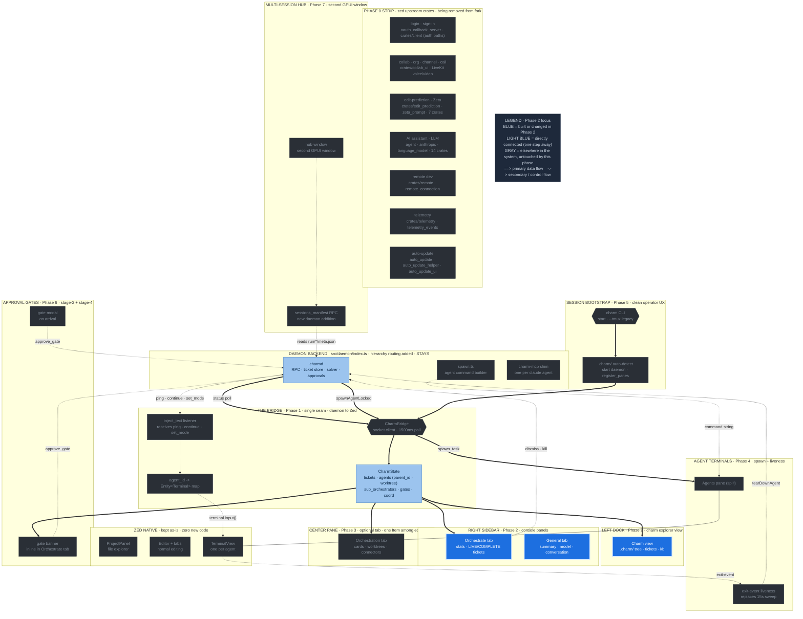

# Phase 2 — Right sidebar + Charm explorer view

**Status:** draft
**Depends on:** Phase 1 (CharmState entity)
**Source:** T-024 (console tabs inventory), T-027 (Panel trait), T-028 (panel strategy), `Orchestration Canvas.dc.html` (panel placement)

The charm read-out lives in two places, matching the design: a **Charm view**
in the left explorer area, and a **right sidebar** with Orchestrate/General
tabs. This is additive — Zed's native file explorer and editor are untouched.

---

## Where this phase sits in the architecture

The full charm-on-Zed architecture, with **Phase 2** highlighted in blue and its direct dependencies (one step away) in light blue. Everything gray is elsewhere in the system, untouched by this phase. Same diagram as the [architecture overview](architecture-diagram.svg), recolored to this phase.



---

## Panel placement (from the design)

The `Orchestration Canvas.dc.html` design is a VS Code-style shell:

- **Left** — activity bar + explorer with **Files / Charm** tabs. Files is
  Zed's native `ProjectPanel`. Charm is a new view of the `.charm/` workspace.
- **Center** — editor tabs + the optional orchestration tab ([Phase 3](phase-3-orchestration-canvas.md)).
- **Right** — sidebar with **Orchestrate / General** tabs.

So Phase 2 builds: the Charm explorer view (left) and the right sidebar (right).
There is no wholesale "replace the console with 4 left-dock panels" — the
earlier framing is superseded by the design's actual layout.

---

## The Panel trait

A dock panel implements:

```rust
pub trait Panel: Focusable + EventEmitter<PanelEvent> + Render + Sized { ... }
```

Required methods (no defaults): `persistent_name()`, `panel_key()`,
`position()`, `position_is_valid()`, `set_position()`, `size()`, `set_size()`,
`icon()`, `icon_tooltip()`, `toggle_action()`. Reference: `crates/project_panel`
and `TerminalPanel` in `crates/terminal_view`.

---

## Left: Charm explorer view (`charm_explorer.rs`)

A second view in the left dock alongside the native file tree, toggled by the
explorer's Files/Charm tab strip.

- Renders the `.charm/` workspace: `tickets/` (each ticket `.md`), `kb/`,
  `COORDINATION.md`, `meta.json`, `worktrees/`
- Ticket and coordination rows carry a real path; clicking a `.md` opens it in
  the center as a rendered markdown tab via Zed's `MarkdownElement`
- Status badges per row (modified / untracked / ticket-dot), same idiom as the
  design's tree
- Files tab itself is Zed's native `ProjectPanel` — zero new code

---

## Right: sidebar (`charm_sidebar.rs`)

A right-dock `Panel` with two tabs.

**Orchestrate tab** (the live coordination read-out):
- Stat row: ACTIVE / WORKTREES / TICKETS counts (big number over a caps label),
  matching the design export section 10.1. These three stats stay fixed; do not
  add or rename them.
- Ticket list grouped into LIVE (open/in_progress/blocked) and COMPLETE
  sections; each row: id, status word, title, stage chip
- Reads `state.tickets` + `state.agents` from the bridge. Both the sidebar and
  the left-dock Charm explorer read from the HIERARCHICAL `CharmState`
  (orchestrator -> sub-orchestrator -> agent) produced by the revised Phase 1
  bridge. The sidebar groups agents under their sub-orchestrator when `agent.worktree`
  is set; top-level agents (no worktree) render directly under the orchestrator
  row.

**General tab:**
- SUMMARY, MODEL & CONTEXT, REPOSITORY sections (static/derived metadata). The
  SUMMARY can show the session label that `set_session_description` already
  writes to `meta.json` — the Phase 1 `status` poll can return it, so this
  works now without waiting for Phase 7's `sessions_manifest` RPC.
- CONVERSATION area — for now a read-only message list; wiring a live composer
  to charmd is open work (charmd has no conversation-stream RPC yet)

---

## Agents + approvals: where they go

The old plan had standalone Agents and Approvals panels. In the design's layout
these fold in more naturally:

- **Agent fleet status** is the Orchestrate tab's stat row + the live ticket
  list (each live ticket maps to an agent). Dismiss/kill actions attach to the
  agent rows there. Double-confirm kill via `pending_kill: Option<AgentId>` +
  timer reset (mirrors the Ink `x·x` mechanic).
- **Approvals** surface primarily as the modal in [Phase 6](phase-6-approval-gates.md),
  plus an inline banner in the Orchestrate tab when a gate is pending. No
  dedicated panel needed.

---

## Shared polling pattern

Both views read the bridge's single `CharmState` entity. Phase 1's polling loop
updates it and calls `cx.notify()`, re-rendering every observer. No per-panel
polling; the chokidar file-watches from the Ink console collapse into this one
update path.

---

## Status: draft
