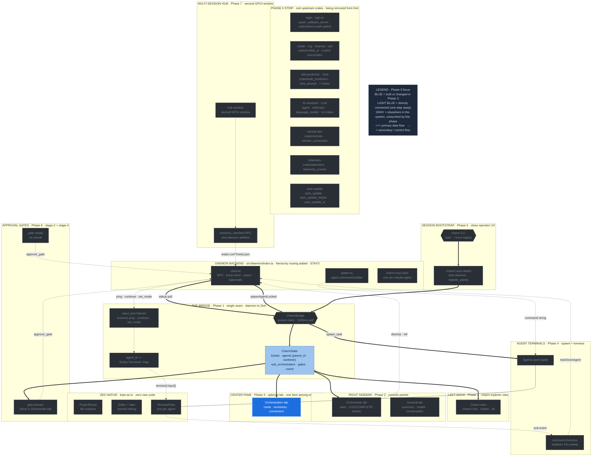

# Phase 3 — Orchestration view (optional center tab)

**Status:** draft
**Depends on:** Phase 1 (CharmState entity)
**Source:** T-025 (canvas design, no-SVG verdict), T-027 (PathBuilder, animation), T-028 (canvas strategy), `Orchestration Canvas.dc.html`

The orchestration view is an **optional tab in the center pane**, opened on
demand. It is one `Item` among your normal editor tabs — open it to see the
fleet, close it to go back to plain editing. It does not take over the window.
This is the single largest build item because GPUI has no SVG and no
`animateMotion`, so it is rendered entirely with GPUI elements + an imperative
animation loop.

---

## Where this phase sits in the architecture

The full charm-on-Zed architecture, with **Phase 3** highlighted in blue and its direct dependencies (one step away) in light blue. Everything gray is elsewhere in the system, untouched by this phase. Same diagram as the [architecture overview](architecture-diagram.svg), recolored to this phase.



---

## It is a tab, not a takeover

Implement `Item` so the view opens as a center-pane tab labeled
"Orchestration". Open it via a command (`charm: Show Orchestration`) or the
Charm activity-bar button. Multiple normal editor tabs coexist with it; closing
it returns to whatever file you were editing. `Item` types are `Entity<T>`
where `T: Render`; only `tab_content_text()` is strictly required.

```rust
pub struct OrchestrationItem {
    state: Entity<CanvasState>,
    animation_frame: Option<Task<()>>,
}
```

---

## The design: card-flow, not a star graph

The current design (`Orchestration Canvas.dc.html`) is **not** the old
concentric-ring SVG node graph. It is a scrollable, zoomable **card layout**:

- **Orchestrator card** — a dark filled card with gold accent text, a label
  ("main"), and a stats row: ACTIVE / TREES / TICKETS.
- **Standalone agent cards** — each with a left accent stripe, status dot, a
  STAGE chip, the ticket id + title, an optional blocker note (`⚠ {note}`), and
  a progress bar + elapsed time.
- **Worktree groups** — dashed-border panels grouping a branch's agent cards,
  labeled with the branch name and a count.
- **Connectors** — straight lines drawn behind the cards from the
  orchestrator to each branch, carrying animated flow dots (HANDOFF section 7.4
  mandates straight edges; do not use curved or elbow routing).
- A zoom control and light/dark theme toggle.

This card-flow layout is **far more GPUI-friendly** than the old star graph:
the cards are plain GPUI divs with flexbox. Only the connector lines and their
traveling dots need custom drawing. This is the design to build.

---

## Rendering (all GPUI primitives, no SVG)

| Design element | GPUI implementation |
|---|---|
| Orchestrator / agent / worktree cards | `div()` with flexbox, borders, accent stripe child |
| Stats row, stage chips, progress bar | nested `div()`s; progress bar is a width-animated fill |
| Status dot | small rounded `div()` |
| Blocker note (`⚠ …`) | conditional `div()` child |
| Connector lines | `cx.paint_path(path_builder)` with `PathBuilder` straight segments (no bezier curves) |
| Traveling flow dots | small quad positioned along the connector at `dot_t` |
| Dashed worktree border | GPUI dashed border style on the group `div()` |

The bulk of the view is plain styled divs — the hard part is just the
connectors and dots. Glow effects (the design's soft halos) have no direct GPUI
equivalent; approximate with layered translucent fills or defer for v1.

---

## CanvasState

```rust
pub struct CanvasState {
    pub orchestrator: OrchestratorCard,
    pub standalone: Vec<AgentCard>,
    pub worktrees: Vec<WorktreeGroup>,
    pub connectors: Vec<Connector>,   // path precomputed; only dot_t advances
    pub zoom: f32,
}

// One group per git worktree. The sub_orchestrator field carries the
// per-worktree sub-orchestrator (rendered as a smaller square per HANDOFF 7.2)
// alongside the agent circles it manages.
pub struct WorktreeGroup {
    pub sub_orchestrator: SubOrchestratorCard,  // renders as a smaller square
    pub agents: Vec<AgentCard>,                 // render as circles
    pub box_bounds: Rect<Pixels>,
}

// SubOrchestratorCard mirrors the fields the canvas needs to render the
// smaller square: its agent id, the worktree name it manages, its current
// status, and how many leaf agents it is running.
pub struct SubOrchestratorCard {
    pub id: AgentId,
    pub worktree: String,
    pub status: AgentStatus,
    pub agent_count: usize,
}

pub struct Connector {
    pub path: Path,        // straight line, recomputed only on topology change
    pub dot_t: f32,        // 0.0..1.0 traveling-dot progress
    pub state: EdgeState,  // active | idle | blocked
}
```

Built from `CharmState` (Phase 1 revised model). The hierarchy derivation uses
**first-class fields only** -- never `touches:` path scanning:

- `CanvasState.worktrees` is built by iterating `CharmState.sub_orchestrators`
  (the `Vec<SubOrchestratorRecord>` added in the Phase 1 revision). One
  `WorktreeGroup` per `SubOrchestratorRecord`.
- Each group's `agents` list is built by filtering `CharmState.agents` on
  `agent.worktree == sub_orchestrator.worktree`.
- `CanvasState.standalone` collects agents where `agent.worktree` is `None`
  (leaf agents that are not assigned to any worktree).
- The `WorktreeGroup.sub_orchestrator` card is populated directly from the
  `SubOrchestratorRecord` fields (`id`, `worktree`, `status`, `agent_count`).

This derivation path is only valid after the Phase 1 revision lands (the
`sub_orchestrators` list and `agent.worktree`/`agent.parent_id` fields must
exist on `CharmState`). Do NOT fall back to inferring the tree from `touches:`
paths -- that is the old approach this model replaces.

Card positions come from a layout function: orchestrator card on the left,
branch cards/worktree groups stacked on the right (the card-flow "activity
feed" orientation), or a ring layout if that is preferred later. Layout is a
pure function on the node list -- unit-testable, no GPUI dependency.

---

## Animation loop (replaces `<animateMotion>`)

```rust
fn start_animation(&mut self, cx: &mut Context<Self>) {
    self.animation_frame = Some(cx.spawn(async move |this, cx| {
        loop {
            cx.background_executor().timer(Duration::from_millis(16)).await;
            this.update(cx, |item, cx| {
                item.state.update(cx, |s, cx| {
                    s.advance_dots(0.016);   // step each connector's dot_t, wrap at 1.0
                    cx.notify();
                });
            }).ok();
        }
    }));
}
```

Pause the loop when the tab is not visible (no point animating a backgrounded
tab) — check the `Item`'s active/focus state and stop the task when hidden.

---

## Click handling

Each card registers a mouse handler:

```rust
div().on_mouse_down(MouseButton::Left, cx.listener(|this, _ev, _w, cx| {
    // open the matching ticket as a markdown tab, or focus the agent terminal
}))
```

Clicking an agent card can open its ticket detail or jump to its terminal tab
([Phase 4](phase-4-terminal-tabs.md)).

---

## Risk: benchmark first

Open question #3 in the README. Before building the full view, prototype: ~15
mock agent cards + worktree groups + animated connectors at 60fps. Expected
well within budget (cards are cheap divs; only the dots animate), but verify.
This is the highest-uncertainty item in the plan.

---

## Status: draft
