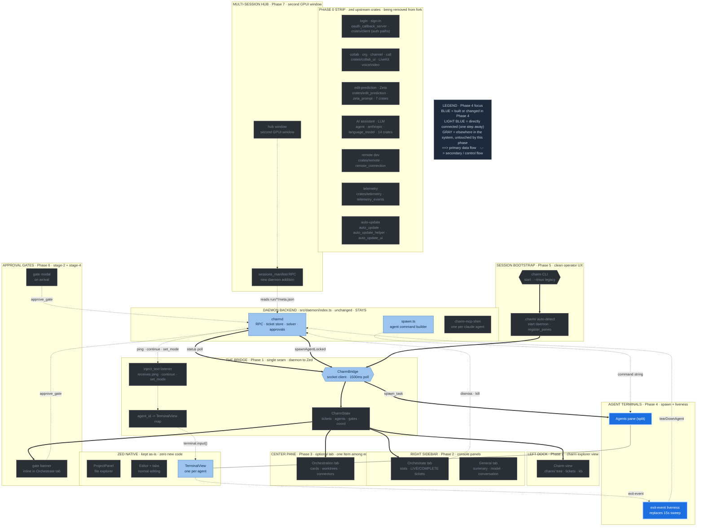

# Phase 4 — Per-agent terminal tabs

**Status:** draft
**Depends on:** Phase 1 (bridge + terminal handle map)
**Source:** T-027 (terminal spawning), T-028 (terminal mapping)

Each claude agent gets its own `TerminalView` in the Zed fork, replacing the
tmux pane. The daemon spawns, kills, and injects text into these terminals
through the bridge.

---

## Where this phase sits in the architecture

The full charm-on-Zed architecture, with **Phase 4** highlighted in blue and its direct dependencies (one step away) in light blue. Everything gray is elsewhere in the system, untouched by this phase. Same diagram as the [architecture overview](architecture-diagram.svg), recolored to this phase.



---

## Sub-orchestrator terminal tabs

Sub-orchestrators are agents too: each per-worktree sub-orchestrator gets its
own terminal tab spawned through the same bridge path as a leaf worker. The
difference is labeling and grouping:

- **Label:** `sub-orch: <worktree-name>` (e.g. `sub-orch: zed-fork`) rather
  than a ticket-id prefix. This makes sub-orchestrator panes visually
  distinguishable from the leaf agent tabs that orbit them.
- **Handle map:** the bridge's `agent_id -> Entity<Terminal>` map must include
  sub-orchestrator IDs alongside leaf agent IDs. There is no separate registry;
  sub-orchestrators are first-class entries in the same map. Phase 3's canvas
  depends on this: clicking a sub-orchestrator card can focus its terminal tab.
- **Spawn path:** identical to leaf agents -- `spawnAgentLocked` is relayed to
  the bridge, which calls `spawn_task` with the sub-orchestrator's command and
  env block. The `CHARM_AGENT_ID` env var is the sub-orchestrator's ID.
- **Teardown path:** also identical -- `tearDownAgent` closes the terminal item
  and calls `bridge.unregister_terminal(agent_id)`.

Sub-orchestrators are spawned before any leaf workers in their worktree, and
reaped after the last leaf worker in their worktree is reaped. Their terminals
should appear at the top of the agents pane for their worktree (or in a
dedicated sub-section if the agents pane gains grouping in a later phase).

---

## Spawning an agent terminal

When the daemon fires `spawnAgentLocked` (relayed to the bridge), open a new
terminal in the agents pane. **Two candidate APIs exist in the source materials
and must be settled by prototype (open question #1):**

- **`terminal_panel.spawn_task(&SpawnInTerminal { command, args, env, cwd, ... })`**
  — T-027 and T-028 both name this as the right entry point: it takes a command
  + args + env + cwd directly and creates the terminal view in the panel. This
  is the higher-level call and is the **preferred candidate**.
- **`project.create_terminal(TerminalKind::Shell(Some(cwd)), window, cx)`** —
  the lower-level call. Creates a `Terminal` entity; you then wrap it in a
  `TerminalView` and add it to the pane yourself, and must set the command
  separately. Use only if `spawn_task` cannot carry the full env block.

Sketch using the preferred candidate:

```rust
workspace.update(cx, |ws, window, cx| {
    let spec = SpawnInTerminal {
        command: "claude".into(),
        args: claude_args,          // --session-id ... --mcp-config ... --append-system-prompt ...
        env: charm_env,             // CHARM_AGENT_ID, CHARM_SOCKET, ...
        cwd: Some(PathBuf::from(cwd)),
        ..Default::default()
    };
    let terminal = terminal_panel.update(cx, |panel, cx| {
        panel.spawn_task(&spec, window, cx)
    });
    ws.add_item_to_pane(&agents_pane, Box::new(terminal_view), None, true, window, cx);

    // Register the handle so the bridge can inject text later:
    bridge.register_terminal(agent_id, terminal);
});
```

The exact field names on `SpawnInTerminal` and whether `spawn_task` returns a
handle suitable for `terminal.input()` injection are what the prototype must
confirm.

The command string itself is unchanged from `spawn.ts`:

```
export CHARM_AGENT_ID=<id>
export CHARM_SOCKET=<socket>
exec claude --session-id <uuid> --model <m> --permission-mode auto \
  --mcp-config <sessionMcpConfig> --append-system-prompt <rolePrompt> <prompt>
```

Only *where* it runs changes (a Zed terminal tab instead of a tmux pane). The
env vars, flags, and system-prompt assembly all stay.

**Open question #1:** the exact `create_terminal` / `TerminalKind` /
`TerminalBuilder` signature for passing a custom command (not the default
shell) plus env vars and cwd. Confirmed to exist from T-027/T-028 source
analysis; needs a prototype to nail the call.

---

## Text injection (pingOrchestrator, continue_agent)

The bridge holds `agent_id -> Entity<Terminal>`. On an inject request:

```rust
terminal_entity.update(cx, |terminal, cx| {
    terminal.input(text.into_bytes());
});
```

`Terminal::input` writes to the PTY master fd — the channel tmux's
`paste-buffer -p` + `send-keys Enter` ultimately reaches.

**Unvalidated (open question + T-028 Risk 1):** do NOT assume bare `input()`
handles multi-line correctly. The tmux path needed bracketed paste because
`send-keys -l` split multi-line messages. Prototype multi-line injection against
a real claude REPL; if newlines submit early, wrap bytes in `ESC[200~ … ESC[201~`.

### Idle-gated delivery for the orchestrator target

Injection to the **orchestrator's** terminal uses the idle-gated pull path
defined in orchestration-model.md Decision 4 and the Phase 1 revision:

- Before calling `terminal.input()`, check whether the operator is mid-input on
  the orchestrator's `TerminalView`.
- If the operator is composing, queue the payload and deliver it at the next
  turn boundary (when the `TerminalView` signals idle). This prevents the
  typing-collision hazard where an injected event interleaves with the operator's
  half-typed message.
- The Zed fork's real `TerminalView` handle makes this reliable; a tmux pane has
  no equivalent idle signal.

Injection to **sub-orchestrator and worker terminals** uses direct
`terminal.input()` with no idle gate -- those terminals are not operator-facing,
so collision is not a concern.

This call serves:

- `pingOrchestrator` — wake the orchestrator after a sub-agent changes state
  (idle-gated; orchestrator terminal target)
- `continue_agent` — deliver orchestrator guidance to a blocked agent
  (direct; sub-orchestrator or worker terminal target)
- `set_mode` — inject `/model <id>` into the orchestrator's REPL
  (idle-gated; orchestrator terminal target)

---

## Liveness (replaces sweepDeadPanes)

Instead of the 15-second `tmux list-panes --pane_dead` poll, subscribe to each
terminal's exit event:

```rust
cx.subscribe(&terminal_entity, |this, _, event, cx| {
    if matches!(event, terminal::Event::CloseTerminal) {
        // mark agent dead, notify daemon, reap
    }
}).detach();
```

This is event-driven and strictly cleaner than the poll. The two-streak filter
(seen-dead-twice before reaping) that the tmux sweep needed to avoid racing a
normal teardown is no longer necessary — the exit event is authoritative.

---

## Teardown

When the daemon fires `tearDownAgent`, close the terminal item:

```rust
agents_pane.update(cx, |pane, cx| {
    pane.close_item_by_id(terminal_view_id, SaveIntent::Skip, window, cx);
});
bridge.unregister_terminal(agent_id);
```

Zed's `PaneGroup` resizes the remaining tabs automatically — no relayout math
(the tmux layout-checksum code is gone entirely).

---

## Status: draft
