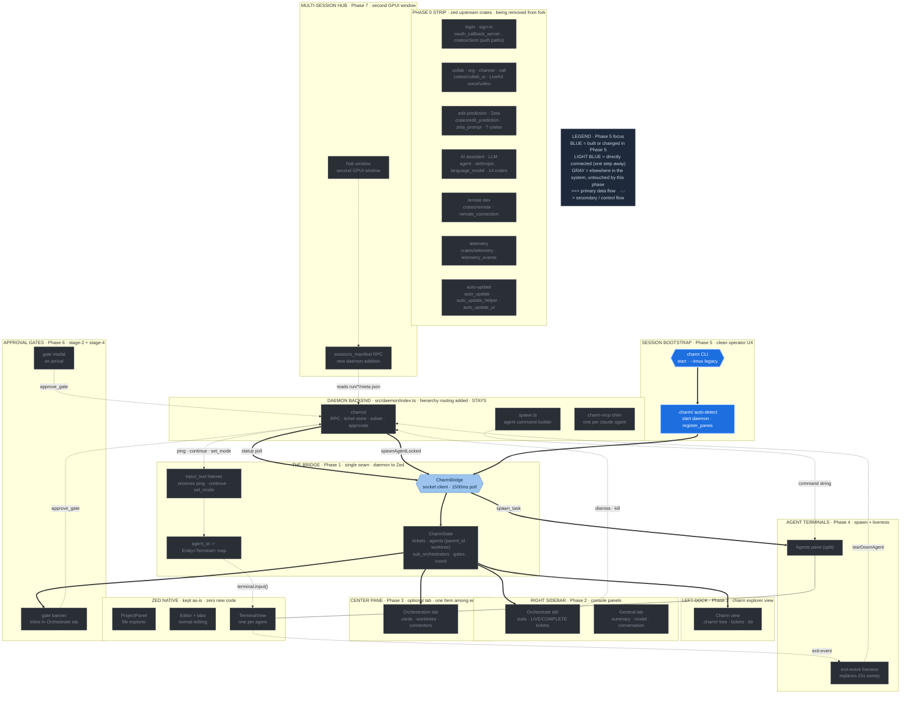

# Phase 5 — Session bootstrap + charm CLI

**Status:** draft
**Depends on:** Phases 1, 2, 4 (the things the bootstrap arranges; Phase 3 is opened on demand, not a boot prerequisite)
**Source:** T-024 (CLI analysis), T-028 (session bootstrap mapping)

Replace the tmux session/pane bootstrap with Zed-native session setup, and
update `charm start` to launch the fork.

---

## Where this phase sits in the architecture

The full charm-on-Zed architecture, with **Phase 5** highlighted in blue and its direct dependencies (one step away) in light blue. Everything gray is elsewhere in the system, untouched by this phase. Same diagram as the [architecture overview](architecture-diagram.svg), recolored to this phase.



---

## Single-daemon / single-.charm bootstrap

One daemon runs in the main workspace and owns the single `.charm` directory for
the entire session. Sub-orchestrators and workers inside any git worktree reach
that daemon via an environment variable (`CHARM_SOCK`), not via a relative
`.charm/` path. This means:

- There is exactly one ticket counter, one registry, one KB, and one proposals
  tree per charm session, regardless of how many worktrees are active.
- Worktree agents write durable artifacts (tickets, KB notes, proposals) through
  MCP tool calls that traverse the socket to the main daemon. They never write
  directly to a `.charm/` directory local to their worktree.
- The daemon starts once (step 1 of the auto-detect sequence below) and
  `spawn.ts` exports `CHARM_SOCK` into every sub-orchestrator and agent command
  so that all panes inherit it automatically.

The auto-detect sequence handles the main workspace open. The worktree creation
path (see "Sub-orchestrator spawn on worktree creation" below) follows the same
approach: the daemon is already running, so new worktree agents inherit
`CHARM_SOCK` directly without any additional startup ceremony.

---

## Auto-detect on workspace open

Add a detector that fires when a workspace loads. If
`<workspace_root>/.charm/` exists, it:

1. Starts the charm daemon if not already running (`charmd` binary, unchanged
   from today)
2. Waits for the daemon socket to appear
3. Connects the bridge ([Phase 1](phase-1-charm-bridge.md))
4. Opens the right sidebar (Orchestrate/General) and registers the Charm
   explorer view in the left dock ([Phase 2](phase-2-console-panels.md))
5. Leaves the center pane on normal editing; the operator opens the
   `OrchestrationItem` tab on demand ([Phase 3](phase-3-orchestration-canvas.md))
6. Splits the center pane right to create the agents pane for terminal tabs

This replaces the tmux `start` ceremony (newSession, spawn console pane, split
agent pane, register_panes, bind `:` key). The `register_panes` RPC still fires
— it tells the daemon which terminal handles belong to the console, orchestrator,
agents pane, and each sub-orchestrator — but the handle type is now a Zed
terminal entity id. Sub-orchestrator handles are added to this map as each
sub-orchestrator is spawned on worktree creation (see "Sub-orchestrator spawn on
worktree creation" below); they are registered using the same RPC, keyed by
agent ID, so the bridge's handle map covers all addressable panes across main
and every active worktree.

The six steps above cover the main workspace open. When a worktree is later
created via `create_worktree`, the bootstrap runs a lighter variant: skip steps
1-4 (daemon already running, bridge already connected), run the dependency
preflight for the new worktree (see "Worktree dependency-sharing preflight"
below), then spawn a sub-orchestrator into that worktree and register its handle
via `register_panes`.

---

## Worktree dependency-sharing preflight

On first `charm start` in a repo, and again on each worktree creation, a
preflight step detects and shares heavy, gitignored dependency directories to
avoid redundant reinstalls across worktrees.

### Candidate detection

The preflight scans the main worktree for gitignored dependency directories:

- `node_modules` (npm / yarn / pnpm)
- `.venv` or `venv` (Python)
- `.next`, `dist`, `vendor/` (build caches)
- `target/` (Rust) -- opt-in only (see below)

### Lockfile-aware sharing (the load-bearing rule)

A dependency directory is shared to a worktree by symlink **only when the
worktree's lockfile hash matches main's**. The relevant lockfiles are:

| Ecosystem | Lockfile |
|---|---|
| npm | `package-lock.json` |
| yarn | `yarn.lock` |
| pnpm | `pnpm-lock.yaml` |
| Rust | `Cargo.lock` |
| Python / uv | `uv.lock` |

If a branch has changed deps (lockfile hash differs), the worktree installs
locally instead of symlinking. Sharing a mismatched dep dir across a dependency
boundary silently corrupts it; the lockfile hash check is the safety gate. There
is no fallback heuristic -- if uncertain, install locally.

### Rust `target/` is opt-in

`target/` can be safely shared when lockfile hashes match, but cargo holds an
advisory lock during builds, so two parallel builds contend on the same
`target/` and thrash rebuild artifacts. It is excluded from the automatic
candidate list and offered to the operator as an opt-in when the rest of the
config is persisted.

### Operator prompt and config persistence

On the first worktree creation in a repo, the preflight presents the detected
candidates to the operator and asks which to share. The answer is written to
`.charm/worktree-config.json` in the main `.charm/` directory (daemon-owned,
not per-worktree). A representative config:

```json
{
  "dep_sharing": {
    "auto_share": ["node_modules", ".venv"],
    "opt_in": ["target"],
    "manual": []
  }
}
```

Subsequent worktrees silently apply the stored config. The prompt fires once per
repo unless the operator explicitly resets the config.

---

## Sub-orchestrator spawn on worktree creation

When `create_worktree` creates a new git worktree, the daemon performs two steps
before the worktree's agents can start work:

1. **Dependency preflight.** Run the lockfile-aware dep-sharing step described
   above. This completes before the sub-orchestrator process starts, so the
   worktree's dependency dirs are in place when the agent runs its first command.

2. **Sub-orchestrator spawn.** The daemon calls `spawnAgentLocked` with role
   `suborchestrator`, working directory set to the worktree root, and
   `CHARM_SOCK` injected into the process environment. This gives the
   sub-orchestrator a direct socket path to the main daemon without needing a
   relative `.charm/` path.

3. **Handle registration.** The resulting terminal handle is registered with
   `register_panes` under the sub-orchestrator's agent ID. From this point, the
   bridge's handle map covers the new sub-orchestrator alongside the main
   orchestrator and any existing leaf agents.

The sub-orchestrator inherits the single-daemon assumption from the moment of
spawn: it writes all durable artifacts (tickets, KB notes, proposals) through
MCP to the main daemon. Its own worktree checkout is for code only.

---

## `charm start` for the Zed fork

Add a CLI path that launches the Zed fork binary with the workspace root as the
argument, then exits. The fork's auto-detect handles the rest.

```
charm start            # launches the Zed fork pointed at cwd
charm start --tmux     # legacy: the existing tmux path, preserved
```

The existing tmux `start` stays working behind `--tmux` for backward
compatibility during the transition. This lets the terminal-only workflow keep
running while the IDE matures.

---

## CLI command dispositions

| Command | Disposition |
|---|---|
| `init` | Unchanged — pure filesystem scaffolding |
| `start` | New default launches the fork; `--tmux` keeps the old path |
| `stop` | Daemon shutdown unchanged; tmux kill drops away (IDE closes its own panels) |
| `attach` | Irrelevant in the IDE (you *are* the app); kept for `--tmux` |
| `resume` | `tmux respawn-pane -k` becomes "open a new terminal tab running `claude --resume <uuid>`" |
| `status` / `approve` | Unchanged — socket RPC |
| `restart` / `reset-kb` | Unchanged — filesystem ops |
| `ctl` (`:q`/`:a`/`:dev`) | Replaced by IDE commands/buttons |

---

## `charm resume` detail

Today `resume` uses `tmux respawn-pane -k` to relaunch the orchestrator's claude
process in the exact same pane. In the fork, this becomes: open a fresh
terminal tab in the agents (or orchestrator) pane running the resume command,
and re-register its handle with the daemon via `orchestrator_pane`. The daemon
side (`orchestrator_pane` RPC) is unchanged — only the handle type differs.

---

## Status: draft
