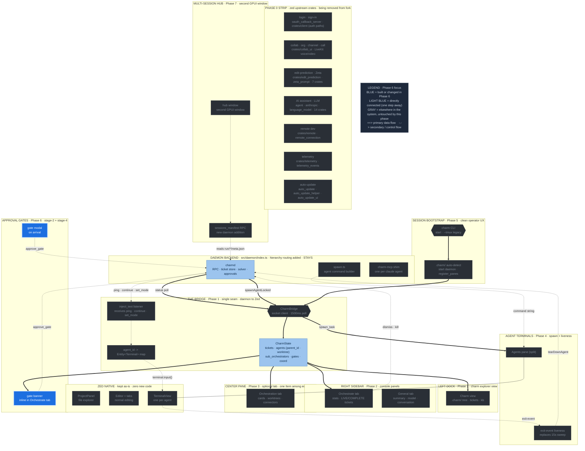

# Phase 6 — Approval gate UX

**Status:** draft
**Depends on:** Phase 2 (Orchestrate tab hosting the inline gate banner), Phase 1 (gate state)
**Source:** T-028 (approval gate UX), T-024 (await_approval mechanics)

The approval gates (Stage 2: approve worker plan; Stage 4: approve diff before
merge) are blocking and must not be missed. Use two layers, mirroring the Ink
console's auto-tab-switch behavior.

---

## Where this phase sits in the architecture

The full charm-on-Zed architecture, with **Phase 6** highlighted in blue and its direct dependencies (one step away) in light blue. Everything gray is elsewhere in the system, untouched by this phase. Same diagram as the [architecture overview](architecture-diagram.svg), recolored to this phase.



---

## How gates work today (unchanged)

The orchestrator calls `await_approval(stage, label)` which blocks in the MCP
shim until a human resolves the gate. The daemon's `ApprovalQueue` stores the
promise and resolves it when `approve_gate` arrives from *any* client. This is
daemon-side state and survives the UI being closed/reopened — the fork does not
change any of this.

The fork only changes how the gate is *surfaced* and how the
approve/reject click reaches `approve_gate`.

---

## Layer 1 — ambient (Orchestrate tab banner)

The ambient layer lives in the **right sidebar's Orchestrate tab**
([Phase 2](phase-2-console-panels.md)), not a separate left-dock panel. When a
gate is pending, an inline banner appears at the top of the Orchestrate tab with
the gate label, stage, and Approve / Reject buttons. An operator with the
sidebar open never misses a gate. This is the baseline.

(Earlier drafts and T-028 section 2 described a standalone left-dock
`ApprovalsPanel`; that is superseded by the design's right-sidebar layout. There
is no separate approvals panel.)

---

## Layer 2 — modal on arrival

When a new gate enters `CharmState.pending_gates`, the bridge dispatches a GPUI
modal so the operator cannot miss a blocking gate even with the panel
collapsed:

```rust
cx.open_modal(window, |modal, _, _| {
    modal.child(
        v_flex()
            .child(Label::new(format!("Stage {} gate", gate.stage)))
            .child(Label::new(gate.label.clone()))
            .child(h_flex()
                .child(Button::new("approve", "Approve")
                    .on_click(cx.listener(move |_, _, _, cx| {
                        approve_gate(socket, gate_id, true, cx);
                    })))
                .child(Button::new("reject", "Reject")
                    .on_click(cx.listener(move |_, _, _, cx| {
                        approve_gate(socket, gate_id, false, cx);
                    }))))
});
```

Both buttons fire the `approve_gate` RPC; the daemon resolves the parked promise
and the orchestrator unblocks.

---

## Surfacing nudges

The Ink console auto-switched to the Approvals tab when `pendingCount > 0`. The
fork's equivalents:

- The modal (above) is the primary nudge
- A badge/status dot on the Orchestrate tab in the right sidebar (the design
  already shows a status dot on the Orchestrate tab when an agent is active)
- Optionally open/focus the right sidebar to the Orchestrate tab when a gate
  arrives

---

## Edge case: daemon restart

If the daemon crashes mid-gate, the in-memory `ApprovalQueue` is lost and any
blocking `await_approval` gets a closed socket. This is a **pre-existing**
limitation, not introduced by the fork — noted here so it is not mistaken for a
regression. Durable gate persistence is out of scope for this proposal.

---

## Gate routing (orchestration-model Decision 1)

Not all gates reach the operator. The daemon routes them by stage:

- **Stage-2 PLAN gate** — owned by the sub-orchestrator *inside its worktree*.
  The sub-orchestrator calls `await_approval(stage=2, ...)`, the daemon routes
  the approval back to that sub-orchestrator, and the sub-orchestrator resolves
  it without the operator's involvement. These gates are NOT pushed to
  `CharmState.pending_gates` and do not appear in the banner or modal.

- **Stage-4 MERGE-TO-MAIN gate** — owned by the top-level orchestrator, because
  merging into the shared tree is the orchestrator's responsibility. This gate
  IS pushed to `pending_gates` and surfaces in the banner/modal to the operator.

- **Escalations** — if a sub-orchestrator encounters a gate it cannot resolve
  (e.g. a conflict requiring operator judgment), it escalates to the orchestrator.
  Escalated gates also appear in `pending_gates` and reach the operator.

What this means for Phase 6 builders: the gate stream arriving in
`CharmState.pending_gates` contains only operator-level decisions (Stage-4 merges
and escalations). The UI does not need to distinguish between these subtypes for
basic rendering -- every entry in `pending_gates` is something the operator must
act on. Stage-2 plan approvals are transparent to this phase; they are handled
entirely by the daemon and the relevant sub-orchestrator.

---

## Status: draft
