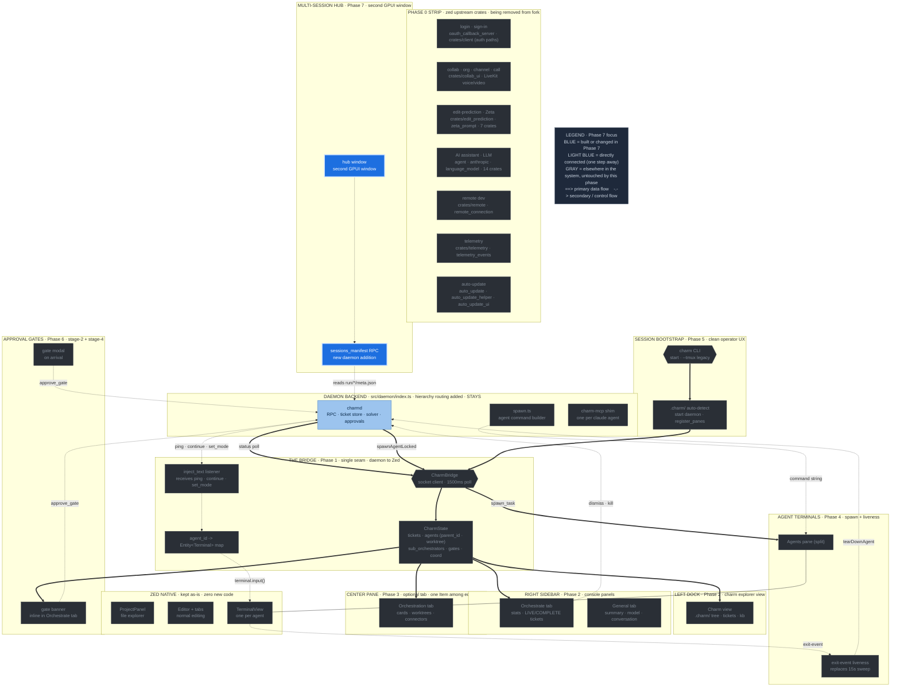

# Phase 7 — Orchestrator Hub (multi-session)

**Status:** draft
**Depends on:** Phase 1 (bridge); needs a new daemon RPC
**Source:** T-025 (Hub gap analysis), T-028 (Hub mapping)

The Hub lets the operator see and switch between multiple charm sessions. Today
each `charm start` is one tmux session = one daemon = one UUID, with no
cross-session view. The Tauri design surfaced this as a separate
`WebviewWindow`; in the fork it is a second GPUI window.

---

## Where this phase sits in the architecture

The full charm-on-Zed architecture, with **Phase 7** highlighted in blue and its direct dependencies (one step away) in light blue. Everything gray is elsewhere in the system, untouched by this phase. Same diagram as the [architecture overview](architecture-diagram.svg), recolored to this phase.



---

## GPUI multi-window

GPUI natively supports multiple top-level windows (Zed uses this for its own
panels). Open the Hub as a second window:

```rust
cx.open_window(WindowOptions { /* small, always-on-top picker */ }, |window, cx| {
    cx.new(|cx| HubView::new(sessions, cx))
});
```

The Hub lists running sessions; clicking one focuses/opens that session's
workspace.

---

## Prerequisite: sessions_manifest RPC (new daemon code)

This is the blocking gap. The daemon currently has no way to enumerate sessions
— each daemon only knows about itself. The Hub needs a manifest.

Add a `sessions_manifest` RPC that scans `.charm/run/*/meta.json` and returns:

```
[
  { uuid, label, status, agent_count, socket_path },
  ...
]
```

This is a **pure addition** — no interface-breaking changes to existing RPC
methods. It reads the `meta.json` files the daemon already writes (including
the label set by `set_session_description`, which currently writes to a dead
end because nothing reads it).

Two implementation options:
- **(a)** Any running daemon answers `sessions_manifest` by scanning the
  sibling `run/*` directories.
- **(b)** A separate lightweight session-registry process owns the manifest.

Option (a) is simpler and sufficient — any daemon can scan the filesystem.

---

## Data flow closure

This phase closes a loop noted in T-025: `set_session_description` writes a
session label to `meta.json`, but with no Hub and no manifest RPC, nothing ever
reads it. Once `sessions_manifest` exists and the Hub renders it, that metadata
finally has a consumer.

---

## Relationship to the within-session hierarchy

The worktree-orchestration model (orchestrator -> sub-orchestrators -> workers)
is a within-session concern. Phase 7 is cross-session and is unaffected by it.

The `sessions_manifest` RPC fits the single-daemon-per-session model exactly:
each daemon knows about itself and can scan sibling `run/*/meta.json` entries
written by other daemons. There is one daemon per session; the Hub aggregates
across those sessions. No change is needed to this RPC's design to accommodate
the within-session hierarchy.

---

## Why this is last

The Hub is multi-session polish. The single-session IDE (Phases 0-6) is fully
useful without it. It also carries the only required new daemon RPC in the whole
plan, so it is cleanly separable and can wait until the core experience is
solid.

---

## Status: draft
