Read through the entire Zed fork migration plan and the source design, then produce a mermaid diagram showing all the features/components and how they connect.

## What to read (in this order)

1. **The proposal (primary):** `.charm/proposals/PROP-zed-fork-build-plan/` — start with `README.md` (the entry point), then all 8 phase files (`phase-0-strip-fork.md` through `phase-7-orchestrator-hub.md`). This is the plan you are reviewing.

2. **The source design:** the Claude Design export the plan is built against, extracted at `/private/tmp/claude-501/-Users-peter-Documents-GitHub-2026-05-29-charm-claude-harness/4cd8c63c-34a9-4f01-bd68-a295c2f000f2/scratchpad/agent-orchestrator-setup/` — read `uploads/HANDOFF.md` (full UI spec) and inspect `Orchestration Canvas.dc.html` (the current card-flow orchestrator-page design). The two PNGs in `uploads/` are the palette and node-graph mockups.

3. **The investigation tickets** that the plan synthesizes: T-023 (Zed/GPUI architecture), T-024 (charm harness deep-dive / TerminalBackend), T-025 (design integration), T-026 (fork setup / crate stripping), T-027 (Zed internals: Panel/Item/PathBuilder), T-028 (charm-to-Zed mapping). Read these ticket bodies for the evidence behind the plan.

## Key architectural framing to respect

The plan is ADDITIVE, not a takeover: keep Zed's native file explorer and file editor; add charm as (a) a right sidebar (Orchestrate/General tabs), (b) a Charm view in the left explorer, and (c) an OPTIONAL orchestration tab in the center pane (one Item among normal editor tabs). The daemon backend (charm-mcp shim, ticket store, solver, approvals, Unix socket RPC) stays unchanged; only the 8 tmux touch-points get replaced by a bridge into the Zed fork.

## Deliverable

Write into THIS ticket body:

1. A **mermaid diagram** (use a ```mermaid fenced code block) that maps all the features/components and how they connect. It should make clear: which pieces are unchanged daemon backend (STAY), which are kept-native Zed (KEPT), and which are new fork code (NEW) — use subgraphs or a legend. Show the data flow: daemon Unix socket -> CharmBridge -> CharmState entity -> the UI surfaces (right sidebar, Charm explorer, orchestration tab, per-agent terminals), and the reverse path (approve_gate, inject_text, spawn/kill agent). Cover all 7 phases' components.

2. A short **consistency review** (a few bullets): any contradictions between phase files, anything in the plan that does not match the design or the investigation-ticket evidence, and any gaps you noticed. Keep it high-signal — this is a real review, not a rubber stamp.

Do NOT modify the proposal files; this is read-only review plus writing your findings into this ticket body.

---

## Findings

### 1. Component + data-flow diagram

```mermaid
flowchart TB
    subgraph STAY["STAY — Unchanged Daemon Backend"]
        charmd["charmd\n(ticket store · solver\n· approvals · RPC)"]
        mcp["charm-mcp shim\n(stdio MCP per claude agent)"]
        spawnts["spawn.ts\n(agent command builder)"]
        ticketdb[".md tickets + sqlite index"]
        kb["kb/"]
        coord["COORDINATION.md"]
        charmd --- ticketdb & kb & coord
        charmd -. "spawns per agent" .-> mcp
    end

    subgraph KEPT["KEPT — Zed Native (zero new code)"]
        projpanel["ProjectPanel\n(file explorer)"]
        editor["Editor\n(file editing)"]
        termview["TerminalView\n(alacritty_terminal)"]
        panes["PaneGroup + Dock\n(tab · split · panel mgmt)"]
        mdelem["MarkdownElement\n(markdown renderer)"]
        panes -.- projpanel & editor & termview
    end

    subgraph NEW["NEW — Fork Code (Phases 0-7)"]
        stripped["Ph 0: Strip 23 crates\n(AI · collab · remote\n· telemetry · auto-update)"]

        bridge["Ph 1: CharmBridge\n(Unix socket client · 1500ms poll)"]
        bridgesock["Ph 1: IDE bridge socket\n(inject_text listener)"]
        state["Ph 1: CharmState entity\n(tickets · agents · pending gates · coord)"]

        explorerv["Ph 2: CharmExplorerView\n(left dock — .charm/ tree)"]
        sidebar["Ph 2: CharmSidebar\n(right dock)"]
        orchtab["Ph 2: Orchestrate tab\n(stats · LIVE/COMPLETE tickets · agent rows)"]
        gentab["Ph 2: General tab\n(summary · model · conversation)"]

        orchitem["Ph 3: OrchestrationItem\n(optional center pane tab)"]
        canvstate["Ph 3: CanvasState\n(orch card · agent cards\n· worktree groups · connectors)"]
        animloop["Ph 3: animation loop\n(16ms timer → dot_t → cx.notify)"]

        agpane["Ph 4: Agents pane\n(right pane split)"]
        handlemap["Ph 4: agent_id → Entity<Terminal> map"]
        liveness["Ph 4: exit event subscriptions\n(replaces 15s sweepDeadPanes poll)"]

        autodetect["Ph 5: workspace auto-detect\n(.charm/ presence → daemon start)"]
        registerp["Ph 5: register_panes RPC call"]
        clicmd["Ph 5: charm CLI updates\n(start → fork   --tmux legacy)"]

        apppanel["Ph 6: ApprovalsPanel\n(ambient — Orchestrate tab inline)"]
        gatemodal["Ph 6: ApprovalGateModal\n(GPUI modal on gate arrival)"]

        hubview["Ph 7: HubView\n(second GPUI window)"]
        sessrpc["Ph 7: sessions_manifest RPC\n(new daemon addition — reads meta.json)"]
    end

    %% Data in: daemon -> bridge -> state
    charmd -->|"status RPC\n(1500ms poll)"| bridge
    bridge -->|"apply + cx.notify()"| state

    %% State -> UI surfaces
    state -->|"reads"| explorerv
    state -->|"reads"| orchtab
    state -->|"reads"| orchitem
    state -->|"reads"| apppanel

    %% Reverse path: UI actions -> daemon
    orchtab -->|"dismiss_agent\nkill_agent RPC"| charmd
    apppanel & gatemodal -->|"approve_gate RPC"| charmd

    %% inject_text path: daemon -> running claude PTYs
    charmd -->|"pingOrchestrator\ncontinue_agent\nset_mode"| bridgesock
    bridgesock -->|"agent_id lookup"| handlemap
    handlemap -->|"terminal.input(bytes)"| termview

    %% Agent spawn path
    charmd -->|"spawnAgentLocked\nnotification"| bridge
    spawnts -->|"command string\n(env + flags + prompt)"| agpane
    bridge -->|"spawn_task(SpawnInTerminal)"| agpane
    agpane --- termview

    %% Liveness: terminal exit -> daemon
    termview --> liveness
    liveness -->|"CloseTerminal event\n-> tearDownAgent RPC"| charmd

    %% Hub: multi-session
    hubview -->|"calls"| sessrpc
    sessrpc -.->|"reads .charm/run/*/meta.json"| charmd

    %% Session init
    autodetect --> bridge
    autodetect --> registerp
    registerp -->|"register_panes RPC"| charmd

    %% Canvas internals
    orchitem --> canvstate --> animloop

    %% Sidebar tabs
    sidebar --> orchtab & gentab
```



---

### 2. Consistency review

**[HIGH] Plan pivots away from its own source recommendations without reconciling them.**
T-023 recommendation: "Stay on Tauri v2 + React. Do not adopt Zed or GPUI at charm's current stage." T-025: "Recommendation: keep Tauri + React. Do not pursue GPUI." The proposal goes the opposite direction. The README's Why-Zed table marks Tauri as "Deferred" (not rejected), and notes GPL is fine for internal use — but it never directly addresses why the investigation findings were overruled. Anyone reading the tickets before the proposal will find the plan contradicts its own evidence. A short "Why we revisited T-023's recommendation" section in the README would close this.

**[HIGH] ApprovalsPanel dock placement is contradicted between Phase 2 and Phase 6.**
Phase 2: "there is no dedicated panel needed" for approvals; they surface as "an inline banner in the Orchestrate tab" (right dock). Phase 6: names a dedicated `ApprovalsPanel` in the "left dock" as "Layer 1 — ambient." These are contradictory — two different docks, two different implementations. The diagram above uses Phase 6's framing (left dock ambient panel), but this needs a decision before Phase 2 or Phase 6 is built.

**[HIGH] Terminal spawn API is split between two different calls across the source materials.**
Phase 4 uses `project.create_terminal(TerminalKind::Shell(...))`. T-027 and T-028 both say `terminal_panel.spawn_task(&SpawnInTerminal {...})` is "the right entry point for charm." Open question #1 in the README acknowledges the uncertainty but the phase files diverge rather than deferring. A worker following Phase 4 and T-028 simultaneously would start with conflicting guidance. This needs a prototype to settle — open question #1 is still open.

**[MEDIUM] Bracketed-paste risk is silently dropped in the phase files.**
Phases 1 and 4 both state that `terminal.input()` handles multi-line text "without bracketed-paste gymnastics." T-028 Risk 1 explicitly flags this as unvalidated: "If claude's REPL disables bracketed paste, bare injection may split on newlines." The plan removed a caveat that the source evidence correctly preserved. Whoever builds Phase 4 should be told to prototype PTY injection with a real claude REPL before assuming it works — the consequence of a bug here is silent orchestrator wake failures.

**[MEDIUM] T-028's 4-panel console mapping is now stale relative to the plan.**
T-028 section 2 maps the Ink console to 4 standalone left-dock GPUI panels (including a separate ApprovalsPanel). Phase 2 explicitly supersedes this: "the earlier framing is superseded by the design's actual layout." That's fine, but it means T-028 is actively misleading as a starting reference for Phase 2 or 6 work. Worth noting in those phase files that T-028 section 2 is pre-design-reconciliation.

**[LOW] `charm resume` target pane is underspecified.**
Phase 5 says resume "becomes: open a fresh terminal tab in the agents (or orchestrator) pane." The "or" leaves ambiguity that Phase 4's `handlemap` registration must resolve — the resumed orchestrator needs to be registered under the orchestrator's agent_id for `pingOrchestrator` injection to find it. Should be pinned before Phase 4 is shipped.

**[LOW] `set_session_description` early-value opportunity is left on the table until Phase 7.**
T-025 flagged this: the RPC writes a session label to `meta.json` but nothing reads it until the Hub exists. The General tab's SUMMARY section (Phase 2) could display this label from Phase 1's polling without waiting for Phase 7's `sessions_manifest` RPC — it's already in `charmd`'s `meta.json` and the bridge polls `status` which can return it.

**[LOW] New `crates/charm/` is implied but not scoped in Phase 0.**
Phase 1 creates `crates/charm/src/charm_bridge.rs`, Phase 3 creates `OrchestrationItem`, etc. None of these live in an existing Zed crate. Phase 0 covers crate deletion but never mentions creating the new `crates/charm/` crate as a Phase 0 or Phase 1 task. A worker doing Phase 0 cleanup won't know to scaffold it.

<!-- CHARM:LOG -->
## Activity

- 2026-06-26T19:16:30.127Z  `investigator-009`  done: Findings written to T-029. Diagram covers all 7 phases across STAY/KEPT/NEW categories with full data-flow paths (daemon socket -> CharmBridge -> CharmState -> UI; approve_gate/inject_text/spawn reverse paths). Four high/medium consistency issues found: (1) plan contradicts T-023/T-025 "stay on Tauri" recommendations without reconciliation; (2) ApprovalsPanel is placed in both left dock (Phase 6) and right-dock Orchestrate tab inline (Phase 2) — direct contradiction; (3) terminal spawn API is split between project.create_terminal (Phase 4) and terminal_panel.spawn_task (T-027/T-028) — open question #1 is still live; (4) bracketed-paste validation risk from T-028 is silently dropped in phase files.
<!-- /CHARM:LOG -->
