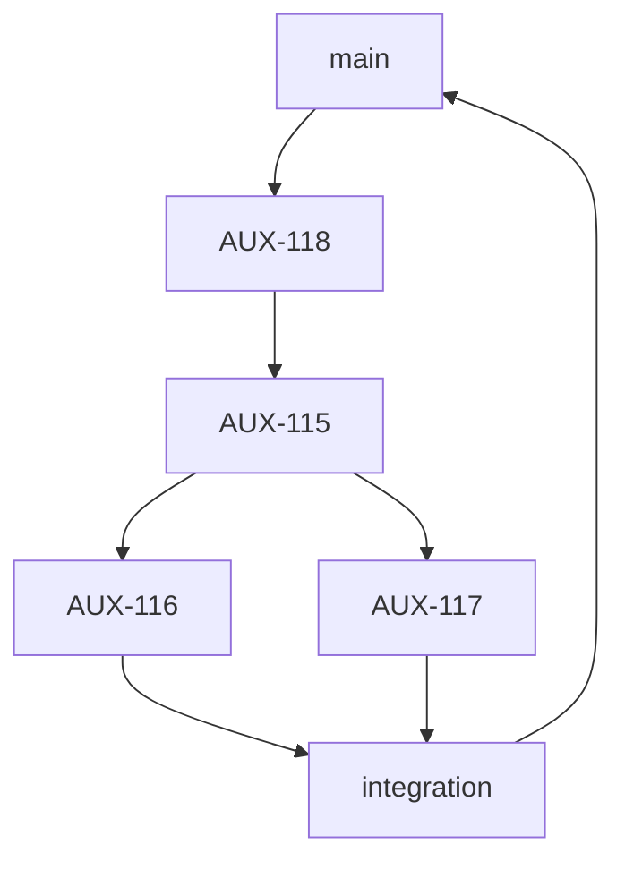

# Skill — Charm Planning (handoff brief, stacked-PR, multi-agent)

Produce a single self-contained markdown brief that the charm orchestrator can execute with no access
to this conversation. The brief turns a set of tickets into a **stack of branches** — each in its own
git worktree, each built on its parent (Graphite-style) — where parallel stacks **converge into one
integration branch that opens a single PR** into the default branch.

The reader is a fresh agent swarm. It has the repo and the brief, nothing else. Everything it needs
must be *in* the brief.

## Precondition: charm session only

This skill only applies when you are running **inside a charm workspace** — a `.charm/` directory
with `.charm/CHARM.md` exists at the repo root. The brief is written into that local `.charm/` tree
for the orchestrator to pick up (see "Output"), so it has no meaning outside a charm session. Before
doing anything, confirm `.charm/` is present; if it isn't, this is the wrong skill — stop and tell
Peter you're not in a charm session.

---

## When to use

Triggers (paraphrases count): "generate a handoff for this ticket", "write a handoff script/brief
for these tickets", "hand this off to the orchestrator / the agents", "turn this ticket into a brief
for agents", "make a stacked-PR plan for [tickets/project]". Peter usually pastes a Linear ticket or
project URL alongside the ask. Only fires inside a charm session (see Precondition above).

Not this skill: creating/editing a Linear ticket (just do that), a human onboarding doc, or any
handoff requested outside a charm workspace.

---

## Inputs and how to gather them

1. **Identify the tickets.** Peter gives a ticket ID/URL, several, or a project. If it's a project
   or an ambiguous set, list the candidate issues and confirm which to include before writing — a
   project usually has more issues than belong in one stack.
2. **Pull the real ticket content from Linear** (`get_issue` / `list_issues` with
   `includeRelations: true`, `get_project`). Read each issue's description and its
   **blocking relations** — `blocks` / `blockedBy` are how you derive the stack order. Do not invent
   scope; inline what the tickets actually say.
3. **Derive the dependency DAG** from the blocking relations. A blocks B ⇒ A is lower in the stack.
   Issues with no edge between them but a shared parent are **parallel stacks**.
4. **Grab Linear's branch name** for each issue (`gitBranchName` on the issue) and use it verbatim.
   PRs whose head branch matches Linear's name auto-link to the issue — that's free traceability,
   don't hand-roll branch names.

If the tickets don't encode their dependencies (no blocking relations), ask Peter for the intended
order rather than guessing — order is the spine of the whole brief.

---

## Output: the brief

Write the brief into the **local `.charm/` tree** — `.charm/scratchpad/handoff-<slug>.md` (the
`scratchpad/` dir is where agents drop docs the orchestrator reads) — and also render it in chat.
This is in-repo, so the orchestrator running in the same charm session reads it directly; don't write
it to a session scratchpad outside the repo. Use these sections, in order. Sections 3 and 4 (topology
+ table) are **required** — they're the part the orchestrator parses to lay out branches.

### 1. Mission + what the agent must produce
One paragraph: build these tickets as stacked branches in separate worktrees; parallel stacks
converge into one integration PR. List the issue IDs. State explicitly that the brief is
self-contained. End with a short checklist of what the run must do (follow the order, build the
stack, reproduce the topology, reproduce the branch table).

### 2. Discover before you build (do not assume)
The brief must tell agents to detect repo conventions rather than guess: package manager / monorepo
tool, backend location + framework, the DB and its **migration tool / ORM** (copy the existing
`migrations/` conventions), how the frontend calls the backend, and the repo's lint / typecheck /
test / build commands. **Never bake in a tech stack you haven't confirmed.** If you know specifics
for sure (Peter told you, or you read the repo), state them; otherwise instruct discovery and tell
agents to record any assumption in the PR description. Guessing the migration framework or ORM is
the most common way these briefs go wrong.

### 3. Order of tickets + stacking model + topology  (required)
- A numbered build order derived from the DAG, calling out which packages are **parallel**.
- The stacking model in one paragraph: each branch is cut from its parent's branch (not the default
  branch) so each PR reviews only its own diff; parallel stacks join in an integration branch that
  is the single PR to the default branch.
- **A Mermaid DAG — this is the plan.** Express the topology as a single Mermaid `graph TD`: nodes
  are tickets (real IDs) plus the integration node; edges run parent → child; forks are one parent
  with multiple children, joins are the parallel children pointing into the integration node. This
  one diagram is the plan of record — it doubles as the picture Peter approves and the structure the
  orchestrator reads, so there's a single source of truth, not a prose description and a diagram that
  can drift. **Render it through the mermaid MCP — never just paste the code block.** Call
  `mcp__mermaid__mermaid_preview` with the DAG and a descriptive `preview_id` (e.g.
  `<project>-stack-topology`) so Peter sees the actual rendered diagram for approval, and on sign-off
  call `mcp__mermaid__mermaid_save` to write the SVG next to the brief in `.charm/scratchpad/`. The fenced
  ```mermaid``` block still goes in the brief verbatim (the orchestrator parses it) — but Peter
  approves the *rendered* image, not the source. Shape:



The plan is sent and approved **once**: render this Mermaid DAG via `mcp__mermaid__mermaid_preview`,
get Peter's sign-off on the rendered diagram, and only then finalize/hand off the brief. Don't
re-issue or mutate the plan mid-run — the approved diagram is fixed for the run.

### 4. PR / branch table  (required)
One row per package plus the integration row. Columns: **Order | Issue | Branch | Branches from |
PR merges into**. Branch = Linear's `gitBranchName`, verbatim. "Branches from" and "PR merges into"
reference parent branches by name; the base ticket branches from and targets the default branch; the
integration branch branches from the top of the trunk, merges in the parallel branches, and targets
the default branch.

### 5. Work packages
One block per ticket: scope (inlined from the ticket), then **acceptance criteria** as a checklist
ending in "typecheck / lint / test / build pass". Carry over any caveats the ticket records (e.g.
"if X is a breaking change, do Y instead") — those are exactly what an agent needs and can't infer.

### 6. Per-PR rules
One PR per package targeting its parent branch; integration PR targets the default branch. PR title
leads with the **real ticket ID**, e.g. `AUX-115: add feature-flag SQL table`; the body includes the
Linear closing keyword with that same ID (e.g. `Fixes AUX-115`), a short rationale, and any
discovery assumptions. Each PR independently passes the validation gate. No cross-package changes.

### 7. Landing
Review bottom-up; merge the integration PR last (it carries the whole feature). Re-run the gate on
the integration branch before merging.

---

## Default stacking model (and the alternative)

**Default: parallel stacks → one integration PR.** Per-package PRs target their parents for
incremental review; only the integration branch merges to the default branch, so the feature lands
as one PR. This is what Peter asked for and the default unless he says otherwise.

**Alternative: classic bottom-up.** Each stacked PR merges to the default branch in order, no
integration branch. Offer this in one line at the end of the brief so Peter can switch with a single
instruction — don't write both into the body.

If the tickets form a single linear chain with no parallelism, there's nothing to converge; skip the
integration branch and just stack linearly to the default branch. Don't manufacture an integration
PR for a straight line.

---

## Authoring rules

These are what make the brief executable by an agent that has none of your context.

1. **Self-contained.** Inline each ticket's scope and acceptance criteria. The orchestrator should
   never need to open Linear — though referencing the issue ID is good for traceability.
2. **Shared-artifact hygiene** (this brief leaves Peter's machine — it goes to another system and
   into PRs). No local paths (`~/.claude/...`, `/Users/...`, `/private/tmp/...`), no private-doc
   pointers or memory slugs, no internal codenames. Repo-relative paths only. Would a new engineer
   understand it cold? If not, rewrite self-contained.
3. **Don't invent tooling.** Migration framework, ORM, backend framework, test commands — confirm or
   instruct discovery. A confidently-wrong `prisma migrate` in a Drizzle repo wastes a whole run.
4. **Branch names are Linear's `gitBranchName`, verbatim** — for PR↔issue auto-linking.
5. **Always use the real ticket IDs, never placeholders.** Write the actual Linear IDs (e.g.
   `AUX-115`, `AUX-116`) everywhere — the topology diagram, the branch table's Issue column, each
   work-package header, and PR titles/closing keywords. A brief full of `<base ticket>` or
   `<TICKET-ID>` forces the orchestrator to guess; concrete IDs make it executable and keep the PRs
   traceable back to the issues. The `<...>` forms in this skill's templates are slots for you to
   fill with those IDs, not text to copy through.
6. **Acceptance criteria, not vibes.** Each package ends in a checklist an agent can self-verify,
   always including the repo's validation gate.
7. **Preserve ticket caveats.** Conditional instructions ("if this breaks, do that instead") are the
   highest-value lines — copy them in.
8. **Keep worktree mechanics light.** State the stack topology and each branch's parent; you don't
   need to script `git worktree add` commands unless Peter asks — orchestrators handle their own
   worktree setup, and brittle command blocks rot.
9. **Render the topology, don't just emit code.** The plan-of-record DAG must be rendered through the
   mermaid MCP (`mcp__mermaid__mermaid_preview`, then `mcp__mermaid__mermaid_save`) so Peter approves
   an actual diagram. Keep the ```mermaid``` source in the brief for the orchestrator, but never
   substitute the raw code block for the rendered image at approval time.

---

## Steps for this skill

1. **Resolve the ticket set.** Confirm which issues are in scope if it's a project or ambiguous.
2. **Fetch** each issue (description + relations) and the project if given; collect `gitBranchName`s.
3. **Build the DAG** from blocking relations → order + parallel groups. If relations are missing,
   ask Peter for the order.
4. **Pick the stacking model** (default: converge to one integration PR; linear if no parallelism).
5. **Render the topology DAG** with `mcp__mermaid__mermaid_preview` and get Peter's sign-off on the
   rendered diagram before finalizing. Save it with `mcp__mermaid__mermaid_save` into `.charm/scratchpad/`.
6. **Write the brief** to `.charm/scratchpad/handoff-<slug>.md` using the section template above
   (including the ```mermaid``` source block verbatim), and render it in chat so Peter can copy it.
7. **Close with the one-line alternative** (classic bottom-up) and a note of any assumption you made
   about the repo's stack so Peter can correct it before sending.
