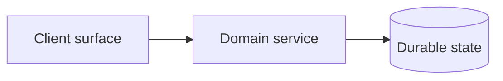

# {{PROJECT_NAME}}

## Status

Proposed architecture and implementation plan.

Implementation details are split into focused documents in the [TDD index](tdds/README.md).
This plan owns product intent, feature scope, and delivery order; the TDDs own subsystem
contracts and acceptance tests. What is actually being built right now lives in
[projects/](projects/README.md) — a project is a scoped, deliverable slice of this plan.

## Platform baseline

{{PLATFORM_BASELINE}}

State the binding constraint explicitly, not just the hardware list. The constraint is what
design decisions get argued against — memory residency, wall-clock, per-token cost, or
concurrent users are different products.

## 1. Product vision

{{ONE_LINE_PREMISE}}

Two or three paragraphs on the shape of the thing. What the system automates, what it leaves
to the human, and what the user is actually paying for. Name the differentiated part — the
work that is genuinely hard and genuinely unserved — because that is what a project scopes
down to when the plan turns out to be too big.

## 2. Goals

- What the system must do, one capability per line.
- Written so each is falsifiable — a reader should be able to say whether it holds.
- Ordered roughly by how much the product loses without it.

## 3. Non-goals for the first release

- What is deliberately out, and cheap to say no to later because it was said here.
- Include the tempting adjacent features, not just the obviously irrelevant ones.

## 4. Core model

The two or three concepts everything else is defined in terms of, and what separates them.
Getting these boundaries right is most of the design; if two layers blur here they will blur
in the schema.

## 5. End-to-end user workflow

1. Numbered walkthrough of the primary path, from empty state to delivered result.
2. Written from the user's side, not the system's.

Note where the workflow allows entry at a point other than step 1 — real users rarely start
at the beginning.

## 6. System architecture

Replace with the real component graph. Each node is a process or a store, each edge a real
call or data flow.

### 6.1 Control plane

What orchestrates, schedules, authorizes, and enforces policy.

### 6.2 Data plane

Where state lives, what is canonical, and what is a rebuildable projection.

### 6.3 Compute plane

Where the work runs, and what the scheduler prioritizes when resources contend.

### 6.4 Stack

| Area | Choice | Responsibility |
| --- | --- | --- |
| | | |

One row per component. The Responsibility column is the load-bearing one: a choice with no
distinct responsibility is a choice that can be removed.

## 7. Feature scope

### 7.1 Priority legend

- **Core:** required for a credible first version.
- **Polish:** needed for a production-capable product.
- **Advanced:** later parity or specialist capability.

### 7.2 &lt;Feature area&gt;

| Priority | Required feature |
| --- | --- |
| Core | |
| Polish | |
| Advanced | |

Repeat per feature area. A TDD may refine how a Core feature is implemented, but may not
silently reduce it.

## 8. Data model

The core records and their important fields. Enough to see the shape and the scoping columns;
exact schemas belong in [TDD-000](tdds/TDD-000-*.md).

| Record | Important fields |
| --- | --- |
| | |

## 9. Delivery order

Phases, what gates each one, and what evidence closes the gate. A phase with no stated exit
criterion is a wish, not a plan.

| Phase | Delivers | Gate |
| --- | --- | --- |
| | | |

## 10. Open questions

Questions whose answers would change the architecture, not the implementation. Each names
what decides it and by when. Anything decision-ready enough to have options and tradeoffs
belongs in the owning TDD's risk records instead.
